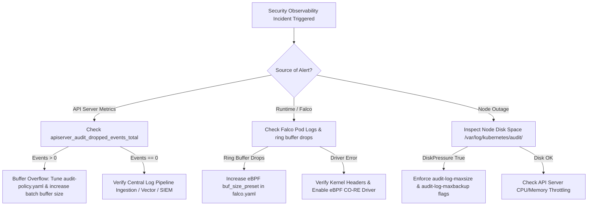

# KCSA Study Guide 5.3: Security Observability

**Exam Certification:** Kubernetes and Cloud Native Security Associate (KCSA)  
**Domain:** Platform Security (16%)  
**Sub-topic 5.3:** Observability  
**Exam Weight:** ~2.29%  

---

## 1. Motivation and Production Architectural Problem

### 1.1 The Security Observability Imperative
In cloud-native production environments, static security controls (such as RBAC, Pod Security Standards, and NetworkPolicies) establish initial boundaries, but they provide zero visibility into post-exploitation behavior or subtle privilege escalation attempts. Security Observability bridges this operational gap by turning control plane operations, kernel-level system calls, and service communication streams into continuous, telemetry-driven security signals.

Traditional infrastructure monitoring focuses on availability, latency, and resource utilization (the "Four Golden Signals"). Security observability, by contrast, focuses on **integrity, non-repudiation, anomalous state transitions, and attack path tracing**.

```
+-----------------------------------------------------------------------------------+
|                                KUBERNETES CLUSTER                                 |
|                                                                                   |
|  +------------------------+    +-----------------------+    +------------------+  |
|  |   Control Plane Level  |    |     Kernel Level      |    |  Network Level   |  |
|  |                        |    |                       |    |                  |  |
|  |  kube-apiserver Audit  |    |   eBPF / Falco Engine |    |  Service Mesh /  |  |
|  |    Policy Engine       |    |  Syscall Ring Buffer  |    |  Cilium Egress   |  |
|  +-----------+------------+    +-----------+-----------+    +--------+---------+  |
+--------------|-----------------------------|-------------------------|------------+
               |                             |                         |
               v                             v                         v
+-----------------------------------------------------------------------------------+
|                            CENTRALIZED TELEMETRY BUS                              |
|          (Fluent Bit / Vector -> Kafka / OpenTelemetry Collector -> SIEM)         |
+-----------------------------------------------------------------------------------+
```

### 1.2 Production Architectural Challenges

1. **Kernel Evasion & In-Container Blind Spots:**  
   Standard container logs capture `stdout`/`stderr` streams emitted by application runtimes. If an attacker gains shell execution inside a Pod via a Remote Code Execution (RCE) vulnerability, running malicious binaries (e.g., `nmap`, `curl`, `nsenter`) or modifying `/etc/ld.so.preload` emits zero output to standard container logging streams. Platform security requires direct introspection of host and container kernel syscalls (`execve`, `ptrace`, `connect`, `openat`).

2. **Kubernetes API Server Audit Noise vs. Storage Exhaustion:**  
   A default Kubernetes API server processes thousands of requests per second from system components (`kubelet`, `kube-proxy`, `coredns`, controller-managers). Logging every API call at the `RequestResponse` level generates hundreds of gigabytes of raw JSON logs daily per cluster. This introduces:
   - **etcd and API Server Latency:** Blocking synchronous audit logging degrades API server request handling performance.
   - **Disk Exhaustion:** Improper rotation policies on control plane nodes exhaust root disk space (`/var/log/kubernetes/audit.log`), crashing `kube-apiserver`.
   - **Signal-to-Noise Ratio (SNR) Degradation:** Essential security events (e.g., creation of a `ClusterRoleBinding` with `cluster-admin` rights or `pods/exec` invocation) get lost in periodic lease renewals and node status updates.

3. **Tamper-Resistance and Log Integrity:**  
   If audit logs or security telemetry remain stored exclusively on local node disks, a compromised root process on the node can wipe `/var/log/` logs to obscure attacker tracks. Log streams must be batched, cryptographically signed, and offloaded asynchronously to immutable write-once-read-many (WORM) storage or central SIEM solutions (e.g., Splunk, Elastic, Loki) outside the cluster's trust domain.

4. **Context Loss Across Telemetry Layers:**  
   Security incidents cross architectural boundaries. An unauthorized egress connection detected at the network interface must be correlated back to:
   - The specific Pod container ID and process namespace via eBPF.
   - The ServiceAccount that requested the workload deployment via Kubernetes API server audit trails.

---

## 2. Technical Comparisons & Trade-off Tables

Security observability in Kubernetes operates across three primary tiers: **Control Plane (API Server Audit)**, **Kernel Runtime (eBPF/Syscall Tracing)**, and **Data Plane/Network (Service Mesh / CNI Telemetry)**.

### 2.1 Security Observability Layer Comparison

| Dimension | Control Plane (API Server Audit) | Kernel Runtime (Falco / eBPF) | Network & Service Mesh (Cilium / Envoy) |
| :--- | :--- | :--- | :--- |
| **Observation Domain** | API requests to `kube-apiserver` (Resource state changes, authentication, RBAC) | Linux System Calls (`execve`, `socket`, `openat`, `setuid`, `ptrace`) | Layer 3/4 network flows and Layer 7 HTTP/gRPC traffic |
| **Capture Point** | `kube-apiserver` webhook or file logging pipeline | eBPF kernel probes / tracepoints / CO-RE | CNI kernel eBPF hooks / Envoy sidecar proxies |
| **Detection Target** | Unauthorized RBAC changes, `exec` calls, Secret reads, ServiceAccount token creation | Reverse shells, privilege escalation, file tampering, unauthorized process spawning | Unexpected egress destinations, mTLS identity policy violations, DNS exfiltration |
| **Latency Impact** | Low to Moderate (if asynchronous batching configured); High if synchronous blocking | Ultra-low overhead (~1-3% CPU overhead via modern eBPF ring buffers) | Low to Moderate (Envoy proxy adds sub-millisecond to millisecond processing latency) |
| **Storage Footprint** | Extremely High if unfiltered (`RequestResponse`); Moderate with strict policy rules | Low to Moderate (Generates targeted alert events on rule match) | High (Flow logs require aggressive aggregation/sampling) |
| **Tamper Resistance** | High (Managed outside workload nodes; hosted on control plane or dedicated SIEM) | High (Kernel eBPF probes operate in ring buffer isolated from container root users) | High (Enforced at kernel or proxy level prior to container boundary) |
| **Failure Risk** | API server memory pressure or dropped audit events during buffer overflows | Kernel panic (rare with verified eBPF); ring buffer event drops under heavy load | Packet drops or application timeout under proxy sidecar failure |

### 2.2 Kubernetes API Audit Policy Levels & Stages

Kubernetes audit policies evaluate requests based on defined **Stages** and **Levels**.

```
Client Request ---> [ RequestReceived ] ---> Authentication / Authorization ---> [ ResponseStarted ] ---> Object Processing / Persistence ---> [ ResponseComplete ]
```

#### Audit Stages
- **`RequestReceived`:** Triggered when the API server handler receives the request, before delegation to authentication/authorization filters.
- **`ResponseStarted`:** Triggered when response headers are sent, but before the response body is streamed (used for long-running calls like `watch` or `exec`).
- **`ResponseComplete`:** Triggered when the response body is fully rendered and returned to the client.
- **`Panic`:** Generated when an uncaught panic occurs during API request processing.

#### Audit Levels Comparison

| Audit Level | Data Captured | Performance Overhead | Primary Security Use Case | Recommended Target Resources |
| :--- | :--- | :--- | :--- | :--- |
| **`None`** | No event recorded | Zero | Silence noisy, low-risk requests | `endpoints`, `leases`, `configmaps` updated by system components, health checks (`/healthz`) |
| **`Metadata`** | Request URI, user, verb, timestamp, source IP, response code, resource group/kind | Minimal | High-volume read/list operations requiring accountability without payload storage | `get`, `list`, `watch` on sensitive resources (`secrets`, `configmaps`, `nodes`) |
| **`Request`** | All `Metadata` PLUS the full raw HTTP request body | Moderate | Track exact spec changes submitted during object creation/modification | `create`, `update`, `patch` on workload specs (`deployments`, `statefulsets`, `daemonsets`) |
| **`RequestResponse`**| All `Request` payload PLUS the complete raw HTTP response body | High | Complete audit trail for ultra-sensitive administrative and authorization events | `roles`, `rolebindings`, `clusterroles`, `clusterrolebindings`, `secrets` (write operations), `pods/exec` |

---

## 3. Complete Syntactically Valid YAML Manifests & Infrastructure Configurations

### 3.1 Production Kubernetes API Audit Policy (`/etc/kubernetes/audit-policy.yaml`)

This complete manifest implements strict security audit rules. High-frequency operational chatter (`leases`, `system:nodes`) is omitted or set to `None`, whereasRBAC modifications, pod execution calls, and secret operations are captured at high fidelity.

```yaml
apiVersion: audit.k8s.io/v1
kind: Policy
omitStages:
  - "RequestReceived"
rules:
  # Rule 1: Ignore high-volume, low-risk system health and status endpoints
  - level: None
    nonResourceURLs:
      - "/healthz*"
      - "/livez*"
      - "/readyz*"
      - "/version"
      - "/metrics"

  # Rule 2: Ignore high-frequency lease renewals and endpoint slices generated by system components
  - level: None
    users:
      - "system:kube-proxy"
      - "system:node-problem-detector"
      - "system:serviceaccount:kube-system:flannel"
    resources:
      - group: ""
        resources: ["endpoints", "services/status"]
      - group: "coordination.k8s.io"
        resources: ["leases"]

  # Rule 3: Log all authentication failures and authorization denials at Metadata level
  - level: Metadata
    userGroups: ["system:authenticated", "system:unauthenticated"]
    verbs: ["get", "list", "create", "update", "patch", "delete"]
    # Captured across all resources implicitly when API server returns HTTP 401 or 403

  # Rule 4: Capture critical workload execution and interactive sessions (pods/exec, pods/portforward, pods/attach) at RequestResponse level
  - level: RequestResponse
    resources:
      - group: ""
        resources: ["pods/exec", "pods/portforward", "pods/attach", "pods/eviction"]

  # Rule 5: Capture all modifications to RBAC security boundaries at RequestResponse level
  - level: RequestResponse
    resources:
      - group: "rbac.authorization.k8s.io"
        resources: ["roles", "rolebindings", "clusterroles", "clusterrolebindings"]

  # Rule 6: Capture modifications to authentication tokens, service accounts, and CRDs at Request level
  - level: Request
    resources:
      - group: ""
        resources: ["serviceaccounts", "secrets", "configmaps"]
      - group: "apiextensions.k8s.io"
        resources: ["customresourcedefinitions"]
    verbs: ["create", "update", "patch", "delete"]

  # Rule 7: Capture read operations on sensitive credential stores at Metadata level to detect credential harvesting
  - level: Metadata
    resources:
      - group: ""
        resources: ["secrets"]
    verbs: ["get", "list", "watch"]

  # Rule 8: Capture workload spec deployments and modifications at Request level
  - level: Request
    resources:
      - group: "apps"
        resources: ["deployments", "statefulsets", "daemonsets", "replicasets"]
      - group: ""
        resources: ["pods"]
    verbs: ["create", "update", "patch", "delete"]

  # Rule 9: Catch-all fallback rule - Log all other standard API traffic at Metadata level
  - level: Metadata
    omitStages:
      - "RequestReceived"
```

### 3.2 Kubernetes Control Plane API Server Configuration (`kube-apiserver.yaml` Snippet)

The following manifest demonstrates how to configure the `kube-apiserver` pod manifest to enable audit logging using an asynchronous batching queue and log file rotation.

```yaml
apiVersion: v1
kind: Pod
metadata:
  name: kube-apiserver
  namespace: kube-system
spec:
  containers:
  - name: kube-apiserver
    image: registry.k8s.io/kube-apiserver:v1.30.0
    command:
      - kube-apiserver
      - --advertise-address=192.168.1.10
      - --allow-privileged=true
      - --authorization-mode=Node,RBAC
      # --- Security Audit Logging Flags ---
      - --audit-policy-file=/etc/kubernetes/audit-policy.yaml
      - --audit-log-path=/var/log/kubernetes/audit/audit.log
      - --audit-log-maxage=30
      - --audit-log-maxbackup=10
      - --audit-log-maxsize=100
      - --audit-log-mode=batch
      - --audit-log-batch-buffer-size=20000
      - --audit-log-batch-max-size=500
      - --audit-log-batch-max-wait=5s
      - --audit-log-batch-throttle-enable=true
      - --audit-log-batch-throttle-qps=100
    volumeMounts:
      - mountPath: /etc/kubernetes/audit-policy.yaml
        name: audit-policy
        readOnly: true
      - mountPath: /var/log/kubernetes/audit/
        name: audit-log
        readOnly: false
  volumes:
    - name: audit-policy
      hostPath:
        path: /etc/kubernetes/audit-policy.yaml
        type: File
    - name: audit-log
      hostPath:
        path: /var/log/kubernetes/audit/
        type: DirectoryOrCreate
```

### 3.3 Production Runtime Security Rules (Falco `falco_rules.yaml` & Config)

This manifest provides custom security rules for Falco (using modern eBPF driver) to intercept interactive container shells, execution of network tools in production namespaces, and unauthorized access to ServiceAccount tokens.

```yaml
# /etc/falco/falco_rules.local.yaml
- rule: Terminal Shell In Container
  desc: Detect interactive shell execution inside a running container
  condition: >
    spawned_process and container
    and shell_procs
    and not user_expected_terminal_shell_exec_conditions
  output: >
    Unauthorized shell spawned in container (user=%user.name user_loginuid=%user.loginuid
    process=%proc.name parent=%proc.pname cmdline=%proc.cmdline container_id=%container.id
    container_name=%container.name image=%container.image.repository:%container.image.tag
    namespace=%k8s.ns.name pod=%k8s.pod.name)
  priority: WARNING
  tags: [container, shell, mitre_execution]

- rule: Sensitive ServiceAccount Token Access by Non-System Process
  desc: Detect access to the mounted Kubernetes service account token file by non-standard process runtimes
  condition: >
    open_read and container
    and fd.name startswith "/var/run/secrets/kubernetes.io/serviceaccount"
    and not proc.name in (kubectl, coredns, pause)
    and not proc.name startswith "java"
    and not proc.name startswith "node"
    and not proc.name startswith "python"
  output: >
    Sensitive ServiceAccount token read attempt (user=%user.name command=%proc.cmdline
    file=%fd.name container_id=%container.id container_name=%container.name
    image=%container.image.repository namespace=%k8s.ns.name pod=%k8s.pod.name)
  priority: CRITICAL
  tags: [container, serviceaccount, credential_access]

- rule: Unauthorized Egress Network Tool Execution
  desc: Detect execution of recon/exfiltration binaries inside container workloads
  condition: >
    spawned_process and container
    and proc.name in (nc, ncat, netcat, nmap, masscan, socat, tcpdump, tshark, zmap)
  output: >
    Security recon binary spawned inside container (command=%proc.cmdline
    user=%user.name container_id=%container.id container_name=%container.name
    namespace=%k8s.ns.name pod=%k8s.pod.name)
  priority: HIGH
  tags: [container, network, reconnaissance]
```

### 3.4 Prometheus Security Alerting Rules (`prometheus-rules.yaml`)

This complete `PrometheusRule` CustomResource evaluates metrics emitted by `kube-apiserver` and Falco exporter to trigger alerts on operational security breaches.

```yaml
apiVersion: monitoring.coreos.com/v1
kind: PrometheusRule
metadata:
  name: security-observability-alerts
  namespace: monitoring
  labels:
    role: alert-rules
spec:
  groups:
    - name: kubernetes.security.audit
      rules:
        - alert: KubernetesAPISecurityRBACDenialsHigh
          expr: >
            sum(rate(apiserver_request_total{code="403"}[5m])) by (verb, resource) > 5
          for: 2m
          labels:
            severity: warning
            category: security
          annotations:
            summary: "High volume of unauthorized API server requests (HTTP 403)"
            description: "The API server denied {{ $value }} requests/sec over the last 5 minutes. Potential unauthorized privilege escalation or lateral movement attempt."

        - alert: KubernetesPodExecVolumeSpike
          expr: >
            sum(rate(apiserver_audit_event_total{resource="pods",subresource="exec"}[5m])) > 0.5
          for: 1m
          labels:
            severity: critical
            category: security
          annotations:
            summary: "Spike in interactive container executions (pods/exec)"
            description: "High rate of pod exec commands detected ({{ $value }} events/sec). Investigate potential manual operator intervention or active container compromise."

        - alert: APIServerAuditEventsDropped
          expr: >
            increase(apiserver_audit_dropped_events_total[5m]) > 0
          for: 0m
          labels:
            severity: critical
            category: platform-integrity
          annotations:
            summary: "Kubernetes API Server is dropping audit log events"
            description: "The API server audit log batch buffer overflowed and dropped {{ $value }} events in the last 5 minutes. Security audit non-repudiation is compromised."

        - alert: FalcoCriticalSecurityEventDetected
          expr: >
            sum(increase(falco_events{priority="Critical"}[5m])) > 0
          for: 0m
          labels:
            severity: critical
            category: runtime-security
          annotations:
            summary: "Falco detected a Critical runtime security rule violation"
            description: "Falco reported {{ $value }} Critical priority runtime security alerts on node {{ $labels.node }}."
```

---

## 4. Real CLI Commands ($) with Expected Terminal Outputs

### 4.1 Inspecting Active API Server Audit Log Configuration

Verify that the active `kube-apiserver` pod is running with the specified policy file and batch parameters:

```bash
$ kubectl get pod -n kube-system -l component=kube-apiserver -o jsonpath='{range .items[*].spec.containers[*].command[*]}{.}{"\n"}{end}' | grep audit
```
```text
--audit-log-batch-buffer-size=20000
--audit-log-batch-max-size=500
--audit-log-batch-max-wait=5s
--audit-log-mode=batch
--audit-log-maxage=30
--audit-log-maxbackup=10
--audit-log-maxsize=100
--audit-log-path=/var/log/kubernetes/audit/audit.log
--audit-policy-file=/etc/kubernetes/audit-policy.yaml
```

### 4.2 Searching API Server Audit Logs for `pods/exec` Security Events

Query the API server JSON audit logs on the control plane node using `jq` to extract interactive shell sessions executed against production pods:

```bash
$ sudo tail -n 5000 /var/log/kubernetes/audit/audit.log | jq -r 'select(.objectRef.subresource=="exec") | {timestamp: .stageTimestamp, user: .user.username, ip: .sourceIPs[0], namespace: .objectRef.namespace, pod: .objectRef.name, container: .objectRef.subresourceParam}'
```
```json
{
  "timestamp": "2026-08-07T19:42:10.812345Z",
  "user": "kubernetes-admin",
  "ip": "192.168.1.150",
  "namespace": "production",
  "pod": "payment-api-7b89569777-4x2lm",
  "container": "payment-container"
}
{
  "timestamp": "2026-08-07T19:45:02.109821Z",
  "user": "system:serviceaccount:jenkins:jenkins-runner",
  "ip": "10.244.2.45",
  "namespace": "payment-system",
  "pod": "stripe-connector-0",
  "container": "connector"
}
```

### 4.3 Querying Falco DaemonSet Security Events via Logs

Inspect real-time Falco runtime alerts emitted when an attacker spawns an unauthorized binary or opens a terminal shell inside a pod:

```bash
$ kubectl logs -n falco -l app.kubernetes.io/name=falco --tail=100 | grep -E 'WARNING|CRITICAL'
```
```text
{"target":"stdout","ts":1786131810123,"priority":"Warning","rule":"Terminal Shell In Container","output":"Unauthorized shell spawned in container (user=root user_loginuid=-1 process=bash parent=containerd-shim cmdline=bash container_id=e7b8a1c9b2f1 container_name=app-frontend image=nginx:latest namespace=default pod=web-frontend-596695b774-v7krm)","output_fields":{"container.id":"e7b8a1c9b2f1","container.image.repository":"nginx","container.name":"app-frontend","k8s.ns.name":"default","k8s.pod.name":"web-frontend-596695b774-v7krm","proc.cmdline":"bash","proc.name":"bash","user.name":"root"}}
{"target":"stdout","ts":1786131945441,"priority":"Critical","rule":"Sensitive ServiceAccount Token Access by Non-System Process","output":"Sensitive ServiceAccount token read attempt (user=www-data command=cat /var/run/secrets/kubernetes.io/serviceaccount/token file=/var/run/secrets/kubernetes.io/serviceaccount/token container_id=a1b2c3d4e5f6 container_name=payment-processor image=custom/payment:v2.1 namespace=finance pod=payment-processor-6c4d7b568-9z8qw)","output_fields":{"container.id":"a1b2c3d4e5f6","container.name":"payment-processor","fd.name":"/var/run/secrets/kubernetes.io/serviceaccount/token","k8s.ns.name":"finance","k8s.pod.name":"payment-processor-6c4d7b568-9z8qw","proc.cmdline":"cat /var/run/secrets/kubernetes.io/serviceaccount/token","user.name":"www-data"}}
```

### 4.4 Prometheus API Server Audit Metrics Query via `curl`

Fetch live metric counters directly from the `kube-apiserver` secure metrics endpoint to verify audit log drop rates and authorization response statuses:

```bash
$ kubectl exec -n kube-system kube-apiserver-control-plane-01 -- curl -s -k --cert /etc/kubernetes/pki/apiserver-kubelet-client.crt --key /etc/kubernetes/pki/apiserver-kubelet-client.key https://127.0.0.1:6443/metrics | grep -E 'apiserver_audit_dropped_events_total|apiserver_request_total.*code="403"'
```
```text
# HELP apiserver_audit_dropped_events_total [ALPHA] Counter of apiserver audit final dropped events.
# TYPE apiserver_audit_dropped_events_total counter
apiserver_audit_dropped_events_total 0
apiserver_request_total{code="403",component="apiserver",contentType="application/json",dry_run="",group="rbac.authorization.k8s.io",resource="clusterroles",subresource="",verb="list",version="v1"} 14
apiserver_request_total{code="403",component="apiserver",contentType="application/json",dry_run="",group="",resource="secrets",subresource="",verb="get",version="v1"} 89
```

---

## 5. Verification and Failure Diagnostic Guide

### 5.1 Production Failure Modes & Root Cause Analysis

#### Failure Mode 1: Audit Event Drops (`apiserver_audit_dropped_events_total > 0`)
- **Root Cause:** The `kube-apiserver` audit logging mechanism operates in `batch` mode with a fixed buffer size (`--audit-log-batch-buffer-size`). When a sudden burst of API traffic occurs (e.g., CI/CD pipelines deploying hundreds of resources simultaneously or a rogue operator querying all cluster secrets), the audit event queue fills faster than the disk writer or webhook backend can flush.
- **Symptom:** Prometheus alerts fire; compliance logs have missing timestamps; gaps exist in incident forensic trails.
- **Remediation:**
  1. Increase `--audit-log-batch-buffer-size` (e.g., from `10000` to `30000`).
  2. Increase QPS ceiling `--audit-log-batch-throttle-qps` from default `10` to `100`.
  3. Refine `/etc/kubernetes/audit-policy.yaml` to demote high-frequency `get`/`list` operations from `RequestResponse` or `Request` down to `Metadata` or `None`.

#### Failure Mode 2: Control Plane Node Disk Space Exhaustion
- **Root Cause:** Log rotation flags (`--audit-log-maxsize`, `--audit-log-maxbackup`) are either missing or misconfigured, allowing raw `/var/log/kubernetes/audit/audit.log` files to consume all available disk space on the control plane node.
- **Symptom:** `kube-apiserver` crashes; `etcd` fails due to write stalls; node transitions to `NotReady` status with `DiskPressure`.
- **Remediation:**
  Ensure `--audit-log-maxsize` is capped (e.g., `100` MB) and `--audit-log-maxbackup` is set (e.g., `10` files). Verify logrotate or system log shippers (Fluent Bit / Vector) consume and purge processed rotation chunks promptly.

#### Failure Mode 3: eBPF Driver Load Failure / Ring Buffer Event Drop in Falco
- **Root Cause:** Kernel updates on host nodes break dynamic eBPF probe compilation, or high-throughput containers flood the kernel-to-user-space eBPF ring buffer.
- **Symptom:** `falco_drop_events_total` metric increases rapidly; Falco pod logs report `ring buffer full, dropping events`.
- **Remediation:**
  1. Switch Falco driver to modern eBPF probe (`BPF_PROG_TYPE_TRACING` via CO-RE - Compile Once, Run Everywhere) available in Linux kernels >= 5.8.
  2. Adjust ring buffer memory sizing in `falco.yaml`: `ebpf.buf_size_preset: 4` (allocates 8MB per CPU core).

### 5.2 Systematic Troubleshooting Flowchart



### 5.3 Diagnostic Checklist Command Sequence

Run this diagnostic checklist when troubleshooting security observability pipeline degradations:

```bash
# Step 1: Check root partition disk usage on control plane host
$ df -h /var/log/kubernetes/audit/

# Step 2: Verify apiserver audit log drop counter metric
$ kubectl get --raw /metrics | grep apiserver_audit_dropped_events_total

# Step 3: Check Falco eBPF ring buffer drop counter
$ kubectl exec -n falco ds/falco -- falco-driver-loader status

# Step 4: Validate audit policy syntax without restarting API server
$ kube-apiserver --audit-policy-file=/etc/kubernetes/audit-policy.yaml --validate-only

# Step 5: Test audit event generation by running a controlled dry-run pod exec
$ kubectl exec -n default deployment/nginx-deployment -- echo "security-audit-test"
```

---

## 6. References

- **CNCF KCSA Exam Curriculum:**  
  [https://github.com/cncf/curriculum/raw/master/KCSA%20Curriculum.pdf](https://github.com/cncf/curriculum/raw/master/KCSA%20Curriculum.pdf)

- **Kubernetes Official Documentation - Auditing Configuration & Policy Specification:**  
  [https://kubernetes.io/docs/tasks/debug/debug-cluster/audit/](https://kubernetes.io/docs/tasks/debug/debug-cluster/audit/)

- **Kubernetes Reference - API Server Command-Line Arguments:**  
  [https://kubernetes.io/docs/reference/command-line-tools-reference/kube-apiserver/](https://kubernetes.io/docs/reference/command-line-tools-reference/kube-apiserver/)

- **Falco Official Documentation - Rules & eBPF Architecture:**  
  [https://falco.org/docs/rules/](https://falco.org/docs/rules/)

- **Prometheus Monitoring - Kubernetes Control Plane Security Metrics:**  
  [https://prometheus.io/docs/prometheus/latest/configuration/alerting_rules/](https://prometheus.io/docs/prometheus/latest/configuration/alerting_rules/)