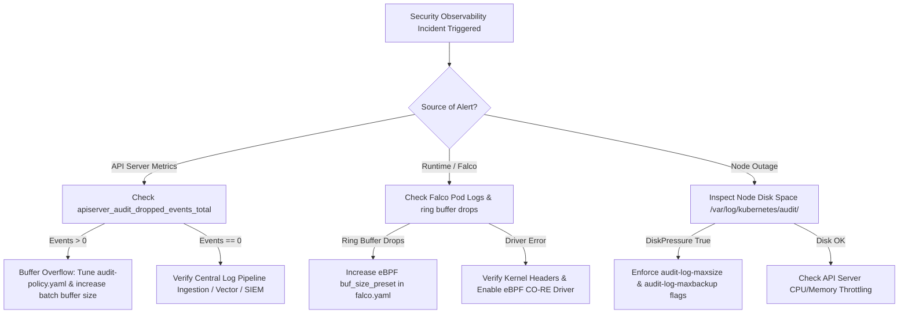

# Guía de Estudio KCSA 5.3: Security Observability

**Certificación del Examen:** Kubernetes and Cloud Native Security Associate (KCSA)  
**Dominio:** Platform Security (16%)  
**Subtema 5.3:** Observability  
**Ponderación del Examen:** ~2.29%  

---

## 1. Motivación y Problema Arquitectónico en Producción

### 1.1 El Imperativo de Security Observability
En entornos de producción cloud-native, los controles de seguridad estáticos (tales como RBAC, Pod Security Standards y NetworkPolicies) establecen límites iniciales, pero proporcionan cero visibilidad sobre el comportamiento posterior a la explotación o sobre intentos sutiles de privilege escalation. Security Observability cierra esta brecha operacional convirtiendo las operaciones del control plane, las llamadas al sistema (system calls) a nivel de kernel y los flujos de comunicación de servicios en señales de seguridad continuas y orientadas a telemetría.

El monitoreo de infraestructura tradicional se enfoca en la disponibilidad, latencia y utilización de recursos (las "Four Golden Signals"). Security observability, por el contrario, se enfoca en **integridad, no repudio, transiciones de estado anómalas y rastreo de rutas de ataque (attack path tracing)**.

```
+-----------------------------------------------------------------------------------+
|                                KUBERNETES CLUSTER                                 |
|                                                                                   |
|  +------------------------+    +-----------------------+    +------------------+  |
|  |   Control Plane Level  |    |     Kernel Level      |    |  Network Level   |  |
|  |                        |    |                       |    |                  |  |
|  |  kube-apiserver Audit  |    |   eBPF / Falco Engine |    |  Service Mesh /  |  |
|  |    Policy Engine       |    |  Syscall Ring Buffer  |    |  Cilium Egress   |  |
|  +-----------+------------+    +-----------+-----------+    +--------+---------+  |
+--------------|-----------------------------|-------------------------|------------+
               |                             |                         |
               v                             v                         v
+-----------------------------------------------------------------------------------+
|                            CENTRALIZED TELEMETRY BUS                              |
|          (Fluent Bit / Vector -> Kafka / OpenTelemetry Collector -> SIEM)         |
+-----------------------------------------------------------------------------------+
```

### 1.2 Desafíos Arquitectónicos en Producción

1. **Evasión de Kernel y Puntos Ciegos dentro del Contenedor:**  
   Los logs estándar de contenedores capturan flujos de `stdout`/`stderr` emitidos por los runtimes de las aplicaciones. Si un atacante obtiene ejecución de shell dentro de un Pod a través de una vulnerabilidad de Remote Code Execution (RCE), la ejecución de binarios maliciosos (ej. `nmap`, `curl`, `nsenter`) o la modificación de `/etc/ld.so.preload` emite cero salida a los flujos estándar de logging del contenedor. La seguridad de la plataforma requiere introspección directa de los syscalls de kernel del host y del contenedor (`execve`, `ptrace`, `connect`, `openat`).

2. **Ruido de Auditoría del Kubernetes API Server vs. Agotamiento de Almacenamiento:**  
   Un Kubernetes API server por defecto procesa miles de solicitudes por segundo de componentes del sistema (`kubelet`, `kube-proxy`, `coredns`, controller-managers). Registrar cada llamada a la API en el nivel `RequestResponse` genera cientos de gigabytes de logs JSON crudos diariamente por cluster. Esto introduce:
   - **Latencia de etcd y API Server:** El audit logging síncrono y bloqueante degrada el rendimiento de manejo de solicitudes del API server.
   - **Agotamiento de Disco:** Políticas de rotación inadecuadas en los nodos del control plane agotan el espacio en disco root (`/var/log/kubernetes/audit.log`), provocando la caída de `kube-apiserver`.
   - **Degradación de la Relación Señal-Ruido (SNR):** Los eventos de seguridad esenciales (ej. la creación de un `ClusterRoleBinding` con derechos de `cluster-admin` o la invocación de `pods/exec`) se pierden en renovaciones periódicas de leases y actualizaciones de estado de los nodos.

3. **Resistencia a Manipulaciones (Tamper-Resistance) e Integridad de Logs:**  
   Si los audit logs o la telemetría de seguridad permanecen almacenados exclusivamente en los discos locales de los nodos, un proceso root comprometido en el nodo puede borrar los logs de `/var/log/` para ocultar el rastro del atacante. Los flujos de logs deben agruparse en lotes (batched), firmarse criptográficamente y descargarse de forma asíncrona a un almacenamiento inmutable write-once-read-many (WORM) o a soluciones SIEM centrales (ej. Splunk, Elastic, Loki) fuera del dominio de confianza del cluster.

4. **Pérdida de Contexto a través de las Capas de Telemetría:**  
   Los incidentes de seguridad cruzan límites arquitectónicos. Una conexión de egress no autorizada detectada en la interfaz de red debe correlacionarse de nuevo con:
   - El ID de contenedor del Pod específico y el namespace del proceso a través de eBPF.
   - La ServiceAccount que solicitó el despliegue del workload a través de los rastros de auditoría del Kubernetes API server.

---

## 2. Comparativas Técnicas y Tablas de Balance (Trade-offs)

La observabilidad de seguridad en Kubernetes opera a través de tres niveles principales: **Control Plane (API Server Audit)**, **Kernel Runtime (eBPF/Syscall Tracing)** y **Data Plane/Network (Service Mesh / CNI Telemetry)**.

### 2.1 Comparación de Capas de Security Observability

| Dimensión | Control Plane (API Server Audit) | Kernel Runtime (Falco / eBPF) | Network & Service Mesh (Cilium / Envoy) |
| :--- | :--- | :--- | :--- |
| **Dominio de Observación** | Solicitudes API a `kube-apiserver` (Cambios de estado de recursos, autenticación, RBAC) | Llamadas al sistema Linux (`execve`, `socket`, `openat`, `setuid`, `ptrace`) | Flujos de red de Capa 3/4 y tráfico HTTP/gRPC de Capa 7 |
| **Punto de Captura** | Webhook o pipeline de logging en archivo de `kube-apiserver` | Probes de kernel eBPF / tracepoints / CO-RE | Hooks eBPF en el kernel de CNI / proxies sidecar Envoy |
| **Objetivo de Detección** | Cambios de RBAC no autorizados, llamadas a `exec`, lecturas de Secret, creación de tokens de ServiceAccount | Reverse shells, privilege escalation, manipulación de archivos, creación no autorizada de procesos | Destinos de egress no esperados, violaciones de políticas de identidad mTLS, exfiltración por DNS |
| **Impacto en Latencia** | Bajo a Moderado (si se configura procesamiento por lotes asíncrono); Alto si hay bloqueo síncrono | Sobrecarga ultra baja (~1-3% sobrecarga de CPU vía ring buffers eBPF modernos) | Bajo a Moderado (el proxy Envoy agrega latencia de procesamiento sub-milisegundo a milisegundo) |
| **Huella de Almacenamiento** | Extremadamente Alta si no se filtra (`RequestResponse`); Moderada con reglas de política strictly definidas | Baja a Moderada (Genera eventos de alerta dirigidos cuando coincide una regla) | Alta (Los logs de flujo requieren agregación/muestreo agresivo) |
| **Resistencia a Manipulaciones** | Alta (Gestionado fuera de los nodos de workload; alojado en el control plane o SIEM dedicado) | Alta (Las probes eBPF del kernel operan en un ring buffer aislado de los usuarios root del contenedor) | Alta (Aplicado a nivel de kernel o proxy antes del límite del contenedor) |
| **Riesgo de Falla** | Presión de memoria en el API server o pérdida de audit events durante desbordamientos de buffer | Kernel panic (raro con eBPF verificado); pérdida de eventos en el ring buffer bajo carga pesada | Pérdida de paquetes o tiempo de espera de la aplicación agotado ante fallas del proxy sidecar |

### 2.2 Niveles y Etapas de Políticas de Auditoría de Kubernetes API

Las políticas de auditoría de Kubernetes evalúan las solicitudes basándose en **Stages** y **Levels** definidos.

```
Client Request ---> [ RequestReceived ] ---> Authentication / Authorization ---> [ ResponseStarted ] ---> Object Processing / Persistence ---> [ ResponseComplete ]
```

#### Audit Stages
- **`RequestReceived`:** Desencadenado cuando el manejador del API server recibe la solicitud, antes de la delegación a los filtros de autenticación/autorización.
- **`ResponseStarted`:** Desencadenado cuando se envían los encabezados de respuesta, pero antes de que el cuerpo de la respuesta sea transmitido (usado para llamadas de larga duración como `watch` o `exec`).
- **`ResponseComplete`:** Desencadenado cuando el cuerpo de la respuesta se procesa por completo y se devuelve al cliente.
- **`Panic`:** Generado cuando ocurre un panic no capturado durante el procesamiento de la solicitud API.

#### Comparación de Audit Levels

| Audit Level | Datos Capturados | Sobrecarga de Rendimiento | Caso de Uso Principal de Seguridad | Recursos Objetivo Recomendados |
| :--- | :--- | :--- | :--- | :--- |
| **`None`** | Ningún evento registrado | Cero | Silenciar solicitudes ruidosas y de bajo riesgo | `endpoints`, `leases`, `configmaps` actualizados por componentes del sistema, chequeos de salud (`/healthz`) |
| **`Metadata`** | URI de la solicitud, user, verb, timestamp, IP de origen, código de respuesta, grupo/kind del recurso | Mínima | Operaciones de lectura/lista de alto volumen que requieren trazabilidad sin almacenamiento de payload | `get`, `list`, `watch` en recursos sensibles (`secrets`, `configmaps`, `nodes`) |
| **`Request`** | Todo `Metadata` MÁS el cuerpo HTTP crudo completo de la solicitud | Moderada | Rastrear cambios exactos en la especificación enviados durante la creación/modificación de objetos | `create`, `update`, `patch` en especificaciones de workloads (`deployments`, `statefulsets`, `daemonsets`) |
| **`RequestResponse`**| Todo el payload de `Request` MÁS el cuerpo HTTP crudo completo de la respuesta | Alta | Registro de auditoría completo para eventos administrativos y de autorización ultra sensibles | `roles`, `rolebindings`, `clusterroles`, `clusterrolebindings`, `secrets` (operaciones de escritura), `pods/exec` |

---

## 3. Manifiestos YAML y Configuraciones de Infraestructura Completos y Sintácticamente Válidos

### 3.1 Política de Auditoría de la API de Kubernetes en Producción (`/etc/kubernetes/audit-policy.yaml`)

Este manifiesto completo implementa reglas estrictas de auditoría de seguridad. El diálogo operativo de alta frecuencia (`leases`, `system:nodes`) se omite o se establece en `None`, mientras que las modificaciones de RBAC, las llamadas de ejecución en pods y las operaciones con secrets se capturan con alta fidelidad.

```yaml
apiVersion: audit.k8s.io/v1
kind: Policy
omitStages:
  - "RequestReceived"
rules:
  # Rule 1: Ignore high-volume, low-risk system health and status endpoints
  - level: None
    nonResourceURLs:
      - "/healthz*"
      - "/livez*"
      - "/readyz*"
      - "/version"
      - "/metrics"

  # Rule 2: Ignore high-frequency lease renewals and endpoint slices generated by system components
  - level: None
    users:
      - "system:kube-proxy"
      - "system:node-problem-detector"
      - "system:serviceaccount:kube-system:flannel"
    resources:
      - group: ""
        resources: ["endpoints", "services/status"]
      - group: "coordination.k8s.io"
        resources: ["leases"]

  # Rule 3: Log all authentication failures and authorization denials at Metadata level
  - level: Metadata
    userGroups: ["system:authenticated", "system:unauthenticated"]
    verbs: ["get", "list", "create", "update", "patch", "delete"]
    # Captured across all resources implicitly when API server returns HTTP 401 or 403

  # Rule 4: Capture critical workload execution and interactive sessions (pods/exec, pods/portforward, pods/attach) at RequestResponse level
  - level: RequestResponse
    resources:
      - group: ""
        resources: ["pods/exec", "pods/portforward", "pods/attach", "pods/eviction"]

  # Rule 5: Capture all modifications to RBAC security boundaries at RequestResponse level
  - level: RequestResponse
    resources:
      - group: "rbac.authorization.k8s.io"
        resources: ["roles", "rolebindings", "clusterroles", "clusterrolebindings"]

  # Rule 6: Capture modifications to authentication tokens, service accounts, and CRDs at Request level
  - level: Request
    resources:
      - group: ""
        resources: ["serviceaccounts", "secrets", "configmaps"]
      - group: "apiextensions.k8s.io"
        resources: ["customresourcedefinitions"]
    verbs: ["create", "update", "patch", "delete"]

  # Rule 7: Capture read operations on sensitive credential stores at Metadata level to detect credential harvesting
  - level: Metadata
    resources:
      - group: ""
        resources: ["secrets"]
    verbs: ["get", "list", "watch"]

  # Rule 8: Capture workload spec deployments and modifications at Request level
  - level: Request
    resources:
      - group: "apps"
        resources: ["deployments", "statefulsets", "daemonsets", "replicasets"]
      - group: ""
        resources: ["pods"]
    verbs: ["create", "update", "patch", "delete"]

  # Rule 9: Catch-all fallback rule - Log all other standard API traffic at Metadata level
  - level: Metadata
    omitStages:
      - "RequestReceived"
```

### 3.2 Configuración del API Server del Control Plane de Kubernetes (Fragmento de `kube-apiserver.yaml`)

El siguiente manifiesto demuestra cómo configurar el manifiesto del pod `kube-apiserver` para habilitar el audit logging utilizando una cola de procesamiento por lotes asíncrona y rotación de archivos de logs.

```yaml
apiVersion: v1
kind: Pod
metadata:
  name: kube-apiserver
  namespace: kube-system
spec:
  containers:
  - name: kube-apiserver
    image: registry.k8s.io/kube-apiserver:v1.30.0
    command:
      - kube-apiserver
      - --advertise-address=192.168.1.10
      - --allow-privileged=true
      - --authorization-mode=Node,RBAC
      # --- Security Audit Logging Flags ---
      - --audit-policy-file=/etc/kubernetes/audit-policy.yaml
      - --audit-log-path=/var/log/kubernetes/audit/audit.log
      - --audit-log-maxage=30
      - --audit-log-maxbackup=10
      - --audit-log-maxsize=100
      - --audit-log-mode=batch
      - --audit-log-batch-buffer-size=20000
      - --audit-log-batch-max-size=500
      - --audit-log-batch-max-wait=5s
      - --audit-log-batch-throttle-enable=true
      - --audit-log-batch-throttle-qps=100
    volumeMounts:
      - mountPath: /etc/kubernetes/audit-policy.yaml
        name: audit-policy
        readOnly: true
      - mountPath: /var/log/kubernetes/audit/
        name: audit-log
        readOnly: false
  volumes:
    - name: audit-policy
      hostPath:
        path: /etc/kubernetes/audit-policy.yaml
        type: File
    - name: audit-log
      hostPath:
        path: /var/log/kubernetes/audit/
        type: DirectoryOrCreate
```

### 3.3 Reglas de Seguridad en Tiempo de Ejecución (Runtime) en Producción (Falco `falco_rules.yaml` y Configuración)

Este manifiesto proporciona reglas de seguridad personalizadas para Falco (utilizando el driver eBPF moderno) para interceptar shells interactivas en contenedores, la ejecución de herramientas de red en namespaces de producción y el acceso no autorizado a tokens de ServiceAccount.

```yaml
# /etc/falco/falco_rules.local.yaml
- rule: Terminal Shell In Container
  desc: Detect interactive shell execution inside a running container
  condition: >
    spawned_process and container
    and shell_procs
    and not user_expected_terminal_shell_exec_conditions
  output: >
    Unauthorized shell spawned in container (user=%user.name user_loginuid=%user.loginuid
    process=%proc.name parent=%proc.pname cmdline=%proc.cmdline container_id=%container.id
    container_name=%container.name image=%container.image.repository:%container.image.tag
    namespace=%k8s.ns.name pod=%k8s.pod.name)
  priority: WARNING
  tags: [container, shell, mitre_execution]

- rule: Sensitive ServiceAccount Token Access by Non-System Process
  desc: Detect access to the mounted Kubernetes service account token file by non-standard process runtimes
  condition: >
    open_read and container
    and fd.name startswith "/var/run/secrets/kubernetes.io/serviceaccount"
    and not proc.name in (kubectl, coredns, pause)
    and not proc.name startswith "java"
    and not proc.name startswith "node"
    and not proc.name startswith "python"
  output: >
    Sensitive ServiceAccount token read attempt (user=%user.name command=%proc.cmdline
    file=%fd.name container_id=%container.id container_name=%container.name
    image=%container.image.repository namespace=%k8s.ns.name pod=%k8s.pod.name)
  priority: CRITICAL
  tags: [container, serviceaccount, credential_access]

- rule: Unauthorized Egress Network Tool Execution
  desc: Detect execution of recon/exfiltration binaries inside container workloads
  condition: >
    spawned_process and container
    and proc.name in (nc, ncat, netcat, nmap, masscan, socat, tcpdump, tshark, zmap)
  output: >
    Security recon binary spawned inside container (command=%proc.cmdline
    user=%user.name container_id=%container.id container_name=%container.name
    namespace=%k8s.ns.name pod=%k8s.pod.name)
  priority: HIGH
  tags: [container, network, reconnaissance]
```

### 3.4 Reglas de Alerta de Seguridad de Prometheus (`prometheus-rules.yaml`)

Este CustomResource `PrometheusRule` completo evalúa las métricas emitidas por `kube-apiserver` y el exporter de Falco para disparar alertas sobre brechas de seguridad operativas.

```yaml
apiVersion: monitoring.coreos.com/v1
kind: PrometheusRule
metadata:
  name: security-observability-alerts
  namespace: monitoring
  labels:
    role: alert-rules
spec:
  groups:
    - name: kubernetes.security.audit
      rules:
        - alert: KubernetesAPISecurityRBACDenialsHigh
          expr: >
            sum(rate(apiserver_request_total{code="403"}[5m])) by (verb, resource) > 5
          for: 2m
          labels:
            severity: warning
            category: security
          annotations:
            summary: "High volume of unauthorized API server requests (HTTP 403)"
            description: "The API server denied {{ $value }} requests/sec over the last 5 minutes. Potential unauthorized privilege escalation or lateral movement attempt."

        - alert: KubernetesPodExecVolumeSpike
          expr: >
            sum(rate(apiserver_audit_event_total{resource="pods",subresource="exec"}[5m])) > 0.5
          for: 1m
          labels:
            severity: critical
            category: security
          annotations:
            summary: "Spike in interactive container executions (pods/exec)"
            description: "High rate of pod exec commands detected ({{ $value }} events/sec). Investigate potential manual operator intervention or active container compromise."

        - alert: APIServerAuditEventsDropped
          expr: >
            increase(apiserver_audit_dropped_events_total[5m]) > 0
          for: 0m
          labels:
            severity: critical
            category: platform-integrity
          annotations:
            summary: "Kubernetes API Server is dropping audit log events"
            description: "The API server audit log batch buffer overflowed and dropped {{ $value }} events in the last 5 minutes. Security audit non-repudiation is compromised."

        - alert: FalcoCriticalSecurityEventDetected
          expr: >
            sum(increase(falco_events{priority="Critical"}[5m])) > 0
          for: 0m
          labels:
            severity: critical
            category: runtime-security
          annotations:
            summary: "Falco detected a Critical runtime security rule violation"
            description: "Falco reported {{ $value }} Critical priority runtime security alerts on node {{ $labels.node }}."
```

---

## 4. Comandos de CLI Reales ($) con Salidas de Terminal Esperadas

### 4.1 Inspección de la Configuración Activa del Audit Log del API Server

Verifique que el pod `kube-apiserver` activo se esté ejecutando con el archivo de política y los parámetros de lote especificados:

```bash
$ kubectl get pod -n kube-system -l component=kube-apiserver -o jsonpath='{range .items[*].spec.containers[*].command[*]}{.}{"\n"}{end}' | grep audit
```
```text
--audit-log-batch-buffer-size=20000
--audit-log-batch-max-size=500
--audit-log-batch-max-wait=5s
--audit-log-mode=batch
--audit-log-maxage=30
--audit-log-maxbackup=10
--audit-log-maxsize=100
--audit-log-path=/var/log/kubernetes/audit/audit.log
--audit-policy-file=/etc/kubernetes/audit-policy.yaml
```

### 4.2 Búsqueda de Eventos de Seguridad `pods/exec` en los Audit Logs del API Server

Consulte los audit logs JSON del API server en el nodo del control plane usando `jq` para extraer sesiones de shell interactivas ejecutadas contra pods de producción:

```bash
$ sudo tail -n 5000 /var/log/kubernetes/audit/audit.log | jq -r 'select(.objectRef.subresource=="exec") | {timestamp: .stageTimestamp, user: .user.username, ip: .sourceIPs[0], namespace: .objectRef.namespace, pod: .objectRef.name, container: .objectRef.subresourceParam}'
```
```json
{
  "timestamp": "2026-08-07T19:42:10.812345Z",
  "user": "kubernetes-admin",
  "ip": "192.168.1.150",
  "namespace": "production",
  "pod": "payment-api-7b89569777-4x2lm",
  "container": "payment-container"
}
{
  "timestamp": "2026-08-07T19:45:02.109821Z",
  "user": "system:serviceaccount:jenkins:jenkins-runner",
  "ip": "10.244.2.45",
  "namespace": "payment-system",
  "pod": "stripe-connector-0",
  "container": "connector"
}
```

### 4.3 Consulta de Eventos de Seguridad del DaemonSet de Falco a través de Logs

Inspeccione las alertas en tiempo de ejecución de Falco emitidas en tiempo real cuando un atacante genera un binario no autorizado o abre una terminal shell dentro de un pod:

```bash
$ kubectl logs -n falco -l app.kubernetes.io/name=falco --tail=100 | grep -E 'WARNING|CRITICAL'
```
```text
{"target":"stdout","ts":1786131810123,"priority":"Warning","rule":"Terminal Shell In Container","output":"Unauthorized shell spawned in container (user=root user_loginuid=-1 process=bash parent=containerd-shim cmdline=bash container_id=e7b8a1c9b2f1 container_name=app-frontend image=nginx:latest namespace=default pod=web-frontend-596695b774-v7krm)","output_fields":{"container.id":"e7b8a1c9b2f1","container.image.repository":"nginx","container.name":"app-frontend","k8s.ns.name":"default","k8s.pod.name":"web-frontend-596695b774-v7krm","proc.cmdline":"bash","proc.name":"bash","user.name":"root"}}
{"target":"stdout","ts":1786131945441,"priority":"Critical","rule":"Sensitive ServiceAccount Token Access by Non-System Process","output":"Sensitive ServiceAccount token read attempt (user=www-data command=cat /var/run/secrets/kubernetes.io/serviceaccount/token file=/var/run/secrets/kubernetes.io/serviceaccount/token container_id=a1b2c3d4e5f6 container_name=payment-processor image=custom/payment:v2.1 namespace=finance pod=payment-processor-6c4d7b568-9z8qw)","output_fields":{"container.id":"a1b2c3d4e5f6","container.name":"payment-processor","fd.name":"/var/run/secrets/kubernetes.io/serviceaccount/token","k8s.ns.name":"finance","k8s.pod.name":"payment-processor-6c4d7b568-9z8qw","proc.cmdline":"cat /var/run/secrets/kubernetes.io/serviceaccount/token","user.name":"www-data"}}
```

### 4.4 Consulta de Métricas de Auditoría del API Server en Prometheus a través de `curl`

Obtenga contadores de métricas en vivo directamente desde el endpoint seguro de métricas de `kube-apiserver` para verificar las tasas de pérdida de audit logs y los estados de respuesta de autorización:

```bash
$ kubectl exec -n kube-system kube-apiserver-control-plane-01 -- curl -s -k --cert /etc/kubernetes/pki/apiserver-kubelet-client.crt --key /etc/kubernetes/pki/apiserver-kubelet-client.key https://127.0.0.1:6443/metrics | grep -E 'apiserver_audit_dropped_events_total|apiserver_request_total.*code="403"'
```
```text
# HELP apiserver_audit_dropped_events_total [ALPHA] Counter of apiserver audit final dropped events.
# TYPE apiserver_audit_dropped_events_total counter
apiserver_audit_dropped_events_total 0
apiserver_request_total{code="403",component="apiserver",contentType="application/json",dry_run="",group="rbac.authorization.k8s.io",resource="clusterroles",subresource="",verb="list",version="v1"} 14
apiserver_request_total{code="403",component="apiserver",contentType="application/json",dry_run="",group="",resource="secrets",subresource="",verb="get",version="v1"} 89
```

---

## 5. Guía de Verificación y Diagnóstico de Fallas

### 5.1 Modos de Falla en Producción y Análisis de Causa Raíz

#### Modo de Falla 1: Caída de Eventos de Auditoría (`apiserver_audit_dropped_events_total > 0`)
- **Causa Raíz:** El mecanismo de audit logging de `kube-apiserver` opera en modo `batch` con un tamaño de buffer fijo (`--audit-log-batch-buffer-size`). Cuando ocurre un pico repentino de tráfico de API (ej. pipelines de CI/CD desplegando cientos de recursos simultáneamente o un operador malicioso consultando todos los secrets del cluster), la cola de eventos de auditoría se llena más rápido de lo que el escritor en disco o el backend de webhook pueden vaciar (flush).
- **Síntoma:** Se disparan alertas de Prometheus; los logs de cumplimiento presentan marcas de tiempo faltantes; existen brechas en los rastros forenses de incidentes.
- **Remediación:**
  1. Incrementar `--audit-log-batch-buffer-size` (ej. de `10000` a `30000`).
  2. Incrementar el límite de QPS `--audit-log-batch-throttle-qps` del valor por defecto de `10` a `100`.
  3. Refinar `/etc/kubernetes/audit-policy.yaml` para degradar las operaciones de alta frecuencia `get`/`list` desde `RequestResponse` o `Request` hacia `Metadata` o `None`.

#### Modo de Falla 2: Agotamiento de Espacio en Disco del Nodo de Control Plane
- **Causa Raíz:** Los flags de rotación de logs (`--audit-log-maxsize`, `--audit-log-maxbackup`) faltan o están mal configurados, permitiendo que los archivos crudos `/var/log/kubernetes/audit/audit.log` consuman todo el espacio en disco disponible en el nodo del control plane.
- **Síntoma:** `kube-apiserver` se cae; `etcd` falla debido a bloqueos de escritura; el nodo pasa al estado `NotReady` con `DiskPressure`.
- **Remediación:**
  Asegurarse de limitar `--audit-log-maxsize` (ej. `100` MB) y configurar `--audit-log-maxbackup` (ej. `10` archivos). Verificar que logrotate o los recolectores de logs del sistema (Fluent Bit / Vector) consuman y purguen oportunamente los fragmentos rotados procesados.

#### Modo de Falla 3: Falla de Carga del Driver eBPF / Pérdida de Eventos en el Ring Buffer en Falco
- **Causa Raíz:** Las actualizaciones del kernel en los nodos host rompen la compilación dinámica de probes eBPF, o contenedores de alto rendimiento inundan el ring buffer eBPF del espacio de kernel a espacio de usuario.
- **Síntoma:** La métrica `falco_drop_events_total` se incrementa rápidamente; los logs del pod de Falco reportan `ring buffer full, dropping events`.
- **Remediación:**
  1. Cambiar el driver de Falco a la probe eBPF moderna (`BPF_PROG_TYPE_TRACING` a través de CO-RE - Compile Once, Run Everywhere) disponible en kernels de Linux >= 5.8.
  2. Ajustar el tamaño de memoria del ring buffer en `falco.yaml`: `ebpf.buf_size_preset: 4` (asigna 8MB por núcleo de CPU).

### 5.2 Diagrama de Flujo de Solución de Problemas Sistemática



### 5.3 Secuencia de Comandos para la Lista de Verificación de Diagnóstico

Ejecute esta lista de verificación de diagnóstico al solucionar problemas de degradación en el pipeline de security observability:

```bash
# Step 1: Check root partition disk usage on control plane host
$ df -h /var/log/kubernetes/audit/

# Step 2: Verify apiserver audit log drop counter metric
$ kubectl get --raw /metrics | grep apiserver_audit_dropped_events_total

# Step 3: Check Falco eBPF ring buffer drop counter
$ kubectl exec -n falco ds/falco -- falco-driver-loader status

# Step 4: Validate audit policy syntax without restarting API server
$ kube-apiserver --audit-policy-file=/etc/kubernetes/audit-policy.yaml --validate-only

# Step 5: Test audit event generation by running a controlled dry-run pod exec
$ kubectl exec -n default deployment/nginx-deployment -- echo "security-audit-test"
```

---

## 6. Referencias

- **CNCF KCSA Exam Curriculum:**  
  [https://github.com/cncf/curriculum/raw/master/KCSA%20Curriculum.pdf](https://github.com/cncf/curriculum/raw/master/KCSA%20Curriculum.pdf)

- **Kubernetes Official Documentation - Auditing Configuration & Policy Specification:**  
  [https://kubernetes.io/docs/tasks/debug/debug-cluster/audit/](https://kubernetes.io/docs/tasks/debug/debug-cluster/audit/)

- **Kubernetes Reference - API Server Command-Line Arguments:**  
  [https://kubernetes.io/docs/reference/command-line-tools-reference/kube-apiserver/](https://kubernetes.io/docs/reference/command-line-tools-reference/kube-apiserver/)

- **Falco Official Documentation - Rules & eBPF Architecture:**  
  [https://falco.org/docs/rules/](https://falco.org/docs/rules/)

- **Prometheus Monitoring - Kubernetes Control Plane Security Metrics:**  
  [https://prometheus.io/docs/prometheus/latest/configuration/alerting_rules/](https://prometheus.io/docs/prometheus/latest/configuration/alerting_rules/)