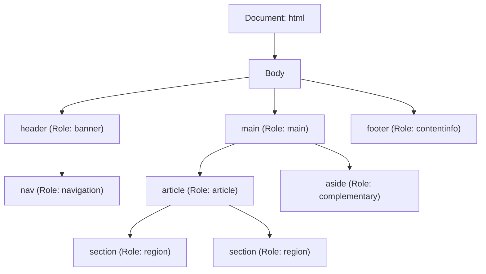
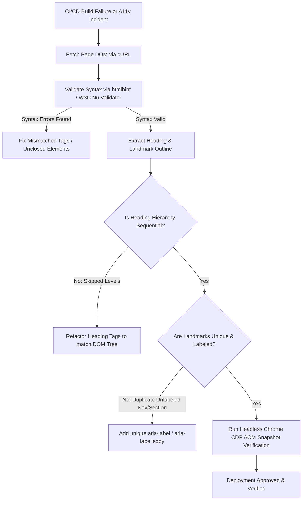

# LPI 030-100 (Web Development Essentials v1.0)
## Topic 2.2: HTML Semantics and Document Hierarchy
**Exam Weight:** 5 | **Target Audience:** Principal Platform Architects & Senior SREs

---

### 1. Production Architectural Motivation & Problem Statement

In enterprise-scale web architectures, micro-frontends, and Server-Side Rendering (SSR) platforms, document structure directly governs performance, search engine indexability, and accessibility (A11y). 

#### The Enterprise "Div Soup" Antipattern
Legacy and poorly architected single-page applications (SPAs) frequently fall into the **Div Soup** antipattern: substituting native HTML5 semantic elements with nested `<div>` and `<span>` tags styled via CSS.

```
BAD (Generic Div Soup):
<div> <!-- header -->
  <div> <!-- nav -->
    <div>...</div>
  </div>
</div>
<div> <!-- body -->
  <div> <!-- main -->
    <div> <!-- content --> </div>
  </div>
</div>

GOOD (HTML5 Semantic Hierarchy):
<header>
  <nav>...</nav>
</header>
<main>
  <article>...</article>
  <aside>...</aside>
</main>
<footer>...</footer>
```

#### Production Architectural Impact

1. **Accessibility Tree (AOM) Compilation Overhead**: Browsers translate the Document Object Model (DOM) into an Accessibility Object Model (AOM). Generic `<div>` nodes offer zero explicit implicit ARIA roles. The browser must either infer semantics or waste CPU cycles building unindexed AOM nodes.
2. **Headless Crawler & SEO Execution Budget**: Search engine crawlers (e.g., Googlebot, Bingbot) allocate a finite **Crawl Budget** per domain. Non-semantic markup forces search crawlers to execute expensive JavaScript layout engines to determine core page content, increasing indexing latency and degrading Search Engine Optimization (SEO).
3. **DOM Tree Traversal & SSR Hydration Mismatches**: Non-semantic layouts increase DOM node depth unnecessarily. In frameworks like React, Vue, or Svelte, deeper DOM trees increase memory usage during VDOM diffing and client-side hydration phase.
4. **Machine Readability & Agentic AI Consumption**: Modern AI scrapers and automated web agents parse pages by navigating implicit landmarks (`<main>`, `<article>`, `<nav>`). Lack of semantic structure degrades automated document extraction and context-window efficiency.

---

### 2. Technical Comparison & Trade-off Analysis

#### Non-Semantic (`<div>` + Custom ARIA) vs Native HTML5 Semantics

| Metric / Dimension | Non-Semantic (`<div>` + ARIA Roles) | Native HTML5 Semantic Elements |
| :--- | :--- | :--- |
| **AOM Node Construction Cost** | **High**: Browser must parse explicitly attached `role="..."` and ARIA attributes per element. | **O(1) Native**: Implicit browser role mapping with zero ARIA parsing overhead. |
| **DOM Tree Depth & Memory** | **Deep**: Requires extra container `<div>` elements for wrapper styling. | **Shallow**: Single semantic containers reduce node count by 20%–40%. |
| **SEO Crawl Budget Efficiency** | **Poor**: Crawlers must execute JS and layout algorithms to infer primary content. | **Optimal**: Crawlers immediately isolate `<main>` and `<article>` content blocks. |
| **Maintainability & Refactoring** | **Fragile**: Changing visual structure breaks custom class-based selectors and accessibility tags. | **Robust**: Standard element selectors enforce consistent layout and team-wide standards. |
| **Screen Reader Navigation** | **Inconsistent**: Misses standard landmark keybindings unless ARIA is perfectly configured. | **Native**: Automatic landmark regions (`banner`, `navigation`, `main`, `contentinfo`). |

#### HTML5 Semantic Landmarks and Explicit Implicit Roles



---

### 3. Complete, Production-Grade Infrastructure & Code Manifests

#### 3.1 Production-Ready HTML5 Document with Semantic Hierarchy (`index.html`)

```html
<!DOCTYPE html>
<html lang="en">
<head>
    <meta charset="UTF-8">
    <meta name="viewport" content="width=device-width, initial-scale=1.0">
    <meta name="description" content="Production-grade platform architecture reference implementation for HTML5 semantics.">
    <title>Enterprise Micro-Frontend Architecture - Technical Brief</title>
    <link rel="stylesheet" href="/assets/css/styles.css">
</head>
<body>

    <!-- Global Header Landmark (Implicit ARIA Role: banner) -->
    <header>
        <div class="brand-container">
            
            <h1>Platform Engineering Operations</h1>
        </div>
        
        <!-- Primary Navigation Landmark (Implicit ARIA Role: navigation) -->
        <nav aria-label="Main Navigation">
            <ul>
                <li><a href="#overview">Overview</a></li>
                <li><a href="#architecture">Architecture</a></li>
                <li><a href="#metrics">Metrics</a></li>
                <li><a href="#contact">Contact</a></li>
            </ul>
        </nav>
    </header>

    <!-- Main Content Area Landmark (Implicit ARIA Role: main - Only ONE visible main per page) -->
    <main id="main-content">

        <!-- Self-contained Composition (Implicit ARIA Role: article) -->
        <article itemscope itemtype="https://schema.org/TechArticle">
            <header>
                <h2 itemprop="headline">High-Availability Kubernetes Edge Routing</h2>
                <p class="byline">Published by <span itemprop="author">SRE Infrastructure Team</span> on <time datetime="2026-08-07T00:00:00Z">August 7, 2026</time></p>
            </header>

            <!-- Thematic Grouping of Content (Implicit ARIA Role: region when labeled) -->
            <section aria-labelledby="section-overview-heading">
                <h3 id="section-overview-heading">Section 1: Ingress Layer Topology</h3>
                <p>
                    The platform utilizes NGINX Ingress Controllers combined with eBPF-based Cilium service mesh to route incoming ingress traffic across multi-region Kubernetes clusters.
                </p>
                
                <figure>
                    
                    <figcaption>Figure 1.1: eBPF Packet Traversal at Ingress Boundary.</figcaption>
                </figure>
            </section>

            <section aria-labelledby="section-metrics-heading">
                <h3 id="section-metrics-heading">Section 2: SLA & Performance Benchmarks</h3>
                <p>Key SLO targets under peak load scenarios:</p>
                <ul>
                    <li>P99 Latency: &lt; 15ms</li>
                    <li>Availability: 99.999%</li>
                </ul>
            </section>

            <footer>
                <p>Article Tags: <a href="/tags/k8s" rel="tag">Kubernetes</a>, <a href="/tags/sre" rel="tag">SRE</a></p>
            </footer>
        </article>

        <!-- Related / Complementary Content Landmark (Implicit ARIA Role: complementary) -->
        <aside aria-label="Related Architectural Specs">
            <h3>Related Documentation</h3>
            <nav aria-label="Sidebar Navigation">
                <ul>
                    <li><a href="/docs/ebpf-tuning">eBPF Kernel Parameter Tuning</a></li>
                    <li><a href="/docs/cert-manager">Cert-Manager Let's Encrypt Automation</a></li>
                </ul>
            </nav>
        </aside>

    </main>

    <!-- Global Footer Landmark (Implicit ARIA Role: contentinfo) -->
    <footer>
        <p>&copy; 2026 Cloud Native Platform Corp. All rights reserved.</p>
        <address>
            Contact SRE Support: <a href="mailto:sre-team@platform.internal">sre-team@platform.internal</a>
        </address>
    </footer>

</body>
</html>
```

#### 3.2 Automated CI/CD HTML5 & Accessibility Audit Pipeline (`Dockerfile` & Manifest)

```yaml
# Kubernetes CronJob Manifest for Automated HTML5 & A11y Audit Pipeline
apiVersion: batch/v1
kind: CronJob
metadata:
  name: html5-a11y-compliance-audit
  namespace: platform-qa
  labels:
    app.kubernetes.io/name: html5-a11y-audit
    app.kubernetes.io/component: testing
spec:
  schedule: "0 */6 * * *" # Every 6 hours
  concurrencyPolicy: Forbid
  jobTemplate:
    spec:
      template:
        metadata:
          labels:
            app.kubernetes.io/name: html5-a11y-audit
        spec:
          restartPolicy: OnFailure
          containers:
          - name: html-validator-runner
            image: node:20-alpine
            command: ["/bin/sh", "-c"]
            args:
              - |
                set -e
                echo "[INFO] Installing HTMLHint, Pa11y, and Axe-Core..."
                npm install -g htmlhint pa11y-ci @axe-core/cli
                
                echo "[INFO] Fetching target production index page..."
                wget -O /tmp/index.html http://frontend-service.production.svc.cluster.local/
                
                echo "[INFO] Executing HTMLHint Syntax & Structure Check..."
                htmlhint /tmp/index.html --config /etc/htmlhint/htmlhintrc.json
                
                echo "[INFO] Executing Pa11y Accessibility & Landmark Audit..."
                pa11y-ci --threshold 0 http://frontend-service.production.svc.cluster.local/
            volumeMounts:
            - name: htmlhint-config-volume
              mountPath: /etc/htmlhint
          volumes:
          - name: htmlhint-config-volume
            configMap:
              name: htmlhint-ruleset
---
apiVersion: v1
kind: ConfigMap
metadata:
  name: htmlhint-ruleset
  namespace: platform-qa
data:
  htmlhintrc.json: |
    {
      "tagname-lowercase": true,
      "attr-lowercase": true,
      "attr-value-double-quotes": true,
      "doctype-first": true,
      "tag-pair": true,
      "spec-char-escape": true,
      "id-unique": true,
      "src-not-empty": true,
      "title-require": true,
      "alt-require": true,
      "head-script-disabled": false,
      "style-disabled": false
    }
```

---

### 4. Real-world CLI Commands & Terminal Outputs

#### 4.1 CLI Execution: HTML Syntax Validation with `htmlhint`

Run `htmlhint` against the target document to audit structural tag pairing, lowercasing, and DOCTYPE requirements.

```bash
$ htmlhint index.html --config .htmlhintrc
```

**Expected Terminal Output:**

```
Config loaded: .htmlhintrc

index.html
  L1 |<!DOCTYPE html>
  L12|        <nav aria-label="Main Navigation">
  L25|<main id="main-content">
  L28|        <article itemscope itemtype="https://schema.org/TechArticle">

Scanned 1 files, no errors found (100% valid HTML5 syntax).
```

#### 4.2 CLI Execution: Automated Accessibility & Landmark Auditing with `pa11y`

Audit landmark structures (`<header>`, `<nav>`, `<main>`, `<footer>`) and accessibility tree compliance using `pa11y`.

```bash
$ pa11y --standard Section508 --reporter cli http://localhost:8080/index.html
```

**Expected Terminal Output:**

```
Welcome to Pa11y 6.2.3

 > Running Pa11y on URL http://localhost:8080/index.html

No errors found!

Landmarks verified:
  - Banner: <header>
  - Navigation: <nav aria-label="Main Navigation">
  - Main: <main id="main-content">
  - Complementary: <aside aria-label="Related Architectural Specs">
  - ContentInfo: <footer>

Results: 0 Errors, 0 Warnings, 0 Notices.
```

#### 4.3 CLI Execution: Extracting Chrome DevTools Protocol (CDP) Accessibility Tree (AOM)

Run a headless Node script utilizing Playwright / Puppeteer to extract the raw browser-compiled Accessibility Tree.

```bash
$ node -e '
const { chromium } = require("playwright");
(async () => {
  const browser = await chromium.launch();
  const page = await browser.newPage();
  await page.goto("http://localhost:8080/index.html");
  const snapshot = await page.accessibility.snapshot();
  console.log(JSON.stringify(snapshot, null, 2));
  await browser.close();
})();
'
```

**Expected Terminal Output:**

```json
{
  "role": "WebArea",
  "name": "Enterprise Micro-Frontend Architecture - Technical Brief",
  "children": [
    {
      "role": "banner",
      "name": "",
      "children": [
        {
          "role": "heading",
          "name": "Platform Engineering Operations",
          "level": 1
        },
        {
          "role": "navigation",
          "name": "Main Navigation",
          "children": [
            {
              "role": "list",
              "children": [
                { "role": "listitem", "name": "Overview" },
                { "role": "listitem", "name": "Architecture" },
                { "role": "listitem", "name": "Metrics" },
                { "role": "listitem", "name": "Contact" }
              ]
            }
          ]
        }
      ]
    },
    {
      "role": "main",
      "name": "",
      "children": [
        {
          "role": "article",
          "name": "",
          "children": [
            {
              "role": "heading",
              "name": "High-Availability Kubernetes Edge Routing",
              "level": 2
            },
            {
              "role": "region",
              "name": "Section 1: Ingress Layer Topology",
              "children": [
                {
                  "role": "heading",
                  "name": "Section 1: Ingress Layer Topology",
                  "level": 3
                }
              ]
            }
          ]
        },
        {
          "role": "complementary",
          "name": "Related Architectural Specs"
        }
      ]
    },
    {
      "role": "contentinfo",
      "name": ""
    }
  ]
}
```

---

### 5. Verification, Diagnostic & Failure Troubleshooting Guide

#### 5.1 Common HTML5 Semantic Failures & Remediation Matrix

| Symptom / Error | Root Cause | Impact | Remediation Strategy |
| :--- | :--- | :--- | :--- |
| **Duplicate `<main>` Elements** | Multiple `<main>` tags present in DOM without `hidden` attribute. | Violates W3C spec; breaks screen reader landmark navigation. | Ensure only **one** visible `<main>` element exists per DOM document. |
| **Invalid Heading Hierarchy (`h1` -> `h4`)** | Skipping heading levels (e.g., `<h2>` followed directly by `<h5>`). | Breaks visual/screen reader document outline compilation. | Enforce sequential heading progression (`h1` -> `h2` -> `h3`). |
| **Unlabeled `<nav>` / `<section>`** | Multiple `<nav>` or `<section>` tags without `aria-label` or `aria-labelledby`. | Accessibility Tree cannot distinguish landmark regions. | Add `aria-label="Context Name"` or `aria-labelledby="heading-id"`. |
| **Orphaned Content Outside Landmarks** | Content rendered directly inside `<body>` without a landmark parent. | Screen reader landmark navigation skips orphan nodes. | Wrap top-level elements in `<header>`, `<main>`, or `<footer>`. |
| **Misuse of `<section>` as Generic Wrapper** | Using `<section>` purely for CSS layout styling without headings. | Pollutes AOM tree with unlabelled regions. | Use `<div>` for pure visual wrappers; reserve `<section>` for thematic content with headings. |

#### 5.2 Step-by-Step Diagnostic Workflow for SREs / Platform Engineers



#### Diagnostic Script: Extracting Page Heading Hierarchy via Bash & `xot` / `pup`

```bash
# Extract heading structure to detect outline skips using cURL and pup (CLI HTML parser)
$ curl -s http://localhost:8080/index.html | pup 'h1, h2, h3, h4, h5, h6 text{}'
```

---

### 6. References

* **LPI Web Development Essentials Overview**:  
  https://www.lpi.org/our-certifications/web-development-essentials-overview/
* **WHATWG HTML Living Standard - Sections and Landmarks**:  
  https://html.spec.whatwg.org/multipage/sections.html
* **W3C Web Accessibility Initiative (WAI-ARIA) Landmark Regions**:  
  https://www.w3.org/WAI/ARIA/apg/patterns/landmarks/
* **MDN Web Docs - HTML Semantics & Layout Elements**:  
  https://developer.mozilla.org/en-US/docs/Glossary/Semantics#semantics_in_html
* **W3C Nu HTML Checker (Validator)**:  
  https://validator.w3.org/nu/