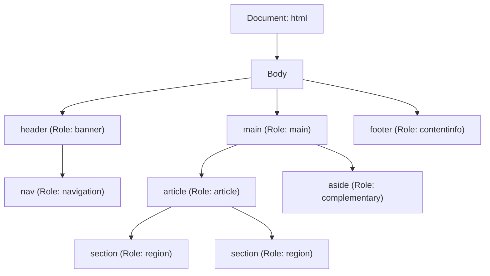
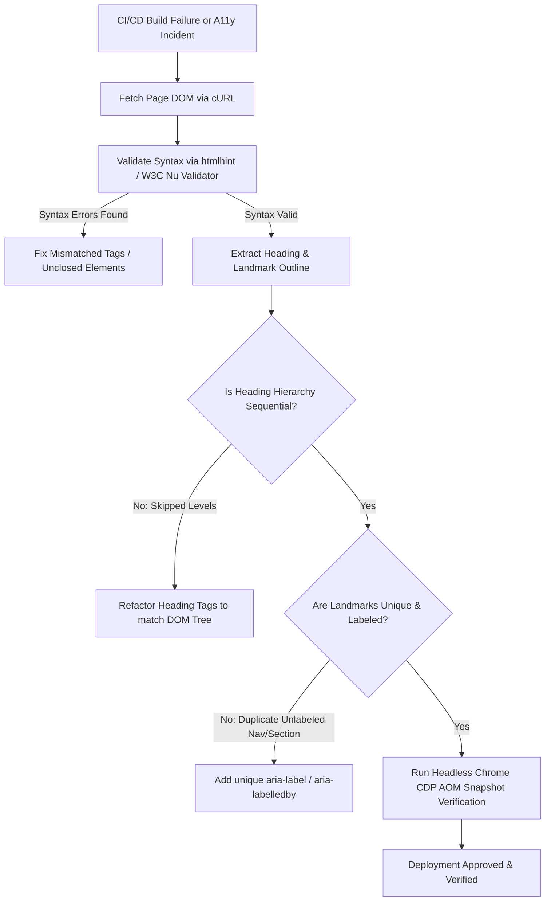

# LPI 030-100 (Web Development Essentials v1.0)
## Tema 2.2: Semántica HTML y Jerarquía de Documentos
**Peso del examen:** 5 | **Audiencia objetivo:** Arquitectos Principales de Plataforma y SREs Senior

---

### 1. Motivación Arquitectónica de Producción y Planteamiento del Problema

En arquitecturas web a escala empresarial, micro-frontends y plataformas de Renderizado del Lado del Servidor (SSR), la estructura del documento rige directamente el rendimiento, la indexabilidad en motores de búsqueda y la accesibilidad (A11y). 

#### El Antipatrón de "Sopa de Divs" Empresarial
Las aplicaciones de una sola página (SPAs) heredadas o con una mala arquitectura caen frecuentemente en el antipatrón de **Sopa de Divs** (Div Soup): sustituir elementos semánticos nativos de HTML5 por etiquetas `<div>` y `<span>` anidadas estilizadas mediante CSS.

```
BAD (Generic Div Soup):
<div> <!-- header -->
  <div> <!-- nav -->
    <div>...</div>
  </div>
</div>
<div> <!-- body -->
  <div> <!-- main -->
    <div> <!-- content --> </div>
  </div>
</div>

GOOD (HTML5 Semantic Hierarchy):
<header>
  <nav>...</nav>
</header>
<main>
  <article>...</article>
  <aside>...</aside>
</main>
<footer>...</footer>
```

#### Impacto Arquitectónico en Producción

1. **Sobrecarga de Compilación del Árbol de Accesibilidad (AOM)**: Los navegadores traducen el Modelo de Objetos del Documento (DOM) a un Modelo de Objetos de Accesibilidad (AOM). Los nodos `<div>` genéricos ofrecen cero roles ARIA implícitos o explícitos. El navegador debe inferir la semántica o desperdiciar ciclos de CPU construyendo nodos AOM no indexados.
2. **Presupuesto de Ejecución de SEO y Crawlers Headless**: Los crawlers de motores de búsqueda (ej., Googlebot, Bingbot) asignan un **Presupuesto de Rastro** (Crawl Budget) finito por dominio. El marcado no semántico fuerza a los crawlers de búsqueda a ejecutar costosos motores de layout de JavaScript para determinar el contenido principal de la página, aumentando la latencia de indexación y degradando la Optimización para Motores de Búsqueda (SEO).
3. **Recorrido del Árbol DOM y Desacoples de Hidratación en SSR**: Los diseños no semánticos aumentan innecesariamente la profundidad de los nodos del DOM. En frameworks como React, Vue o Svelte, los árboles DOM más profundos incrementan el uso de memoria durante la diferenciación de VDOM (VDOM diffing) y la fase de hidratación del lado del cliente.
4. **Lecturabilidad por Máquinas y Consumo por IA Agéntica**: Los scrapers de IA modernos y los agentes web automatizados parsean páginas navegando por puntos de referencia (landmarks) implícitos (`<main>`, `<article>`, `<nav>`). La falta de estructura semántica degrada la extracción automatizada de documentos y la eficiencia de la ventana de contexto.

---

### 2. Comparación Técnica y Análisis de Compromisos (Trade-offs)

#### No Semántico (`<div>` + ARIA Personalizado) vs Semántica Nativa de HTML5

| Métrica / Dimensión | No Semántico (`<div>` + Roles ARIA) | Elementos Semánticos Nativos de HTML5 |
| :--- | :--- | :--- |
| **Costo de Construcción de Nodos AOM** | **Alto**: El navegador debe parsear explícitamente los atributos `role="..."` y ARIA adjuntos por elemento. | **O(1) Nativo**: Mapeo implícito de roles del navegador con cero sobrecarga de parseo ARIA. |
| **Profundidad y Memoria del Árbol DOM** | **Profundo**: Requiere elementos `<div>` contenedores adicionales para el estilo del wrapper. | **Poco profundo**: Los contenedores semánticos únicos reducen la cantidad de nodos entre un 20% y un 40%. |
| **Eficiencia del Crawl Budget en SEO** | **Pobre**: Los crawlers deben ejecutar JS y algoritmos de layout para inferir el contenido primario. | **Óptimo**: Los crawlers aíslan inmediatamente los bloques de contenido `<main>` y `<article>`. |
| **Mantenibilidad y Refactorización** | **Frágil**: Cambiar la estructura visual rompe los selectores personalizados basados en clases y las etiquetas de accesibilidad. | **Robusto**: Los selectores de elementos estándar imponen un layout consistente y estándares a nivel de equipo. |
| **Navegación con Lectores de Pantalla** | **Inconsistente**: Pierde los atajos de teclado estándar para landmarks a menos que ARIA esté perfectamente configurado. | **Nativo**: Regiones de landmark automáticas (`banner`, `navigation`, `main`, `contentinfo`). |

#### Landmarks Semánticos de HTML5 y Roles Implícitos/Explícitos



---

### 3. Manifiestos de Código e Infraestructura de Nivel de Producción Completos

#### 3.1 Documento HTML5 Listo para Producción con Jerarquía Semántica (`index.html`)

```html
<!DOCTYPE html>
<html lang="en">
<head>
    <meta charset="UTF-8">
    <meta name="viewport" content="width=device-width, initial-scale=1.0">
    <meta name="description" content="Production-grade platform architecture reference implementation for HTML5 semantics.">
    <title>Enterprise Micro-Frontend Architecture - Technical Brief</title>
    <link rel="stylesheet" href="/assets/css/styles.css">
</head>
<body>

    <!-- Global Header Landmark (Implicit ARIA Role: banner) -->
    <header>
        <div class="brand-container">
            
            <h1>Platform Engineering Operations</h1>
        </div>
        
        <!-- Primary Navigation Landmark (Implicit ARIA Role: navigation) -->
        <nav aria-label="Main Navigation">
            <ul>
                <li><a href="#overview">Overview</a></li>
                <li><a href="#architecture">Architecture</a></li>
                <li><a href="#metrics">Metrics</a></li>
                <li><a href="#contact">Contact</a></li>
            </ul>
        </nav>
    </header>

    <!-- Main Content Area Landmark (Implicit ARIA Role: main - Only ONE visible main per page) -->
    <main id="main-content">

        <!-- Self-contained Composition (Implicit ARIA Role: article) -->
        <article itemscope itemtype="https://schema.org/TechArticle">
            <header>
                <h2 itemprop="headline">High-Availability Kubernetes Edge Routing</h2>
                <p class="byline">Published by <span itemprop="author">SRE Infrastructure Team</span> on <time datetime="2026-08-07T00:00:00Z">August 7, 2026</time></p>
            </header>

            <!-- Thematic Grouping of Content (Implicit ARIA Role: region when labeled) -->
            <section aria-labelledby="section-overview-heading">
                <h3 id="section-overview-heading">Section 1: Ingress Layer Topology</h3>
                <p>
                    The platform utilizes NGINX Ingress Controllers combined with eBPF-based Cilium service mesh to route incoming ingress traffic across multi-region Kubernetes clusters.
                </p>
                
                <figure>
                    
                    <figcaption>Figure 1.1: eBPF Packet Traversal at Ingress Boundary.</figcaption>
                </figure>
            </section>

            <section aria-labelledby="section-metrics-heading">
                <h3 id="section-metrics-heading">Section 2: SLA & Performance Benchmarks</h3>
                <p>Key SLO targets under peak load scenarios:</p>
                <ul>
                    <li>P99 Latency: &lt; 15ms</li>
                    <li>Availability: 99.999%</li>
                </ul>
            </section>

            <footer>
                <p>Article Tags: <a href="/tags/k8s" rel="tag">Kubernetes</a>, <a href="/tags/sre" rel="tag">SRE</a></p>
            </footer>
        </article>

        <!-- Related / Complementary Content Landmark (Implicit ARIA Role: complementary) -->
        <aside aria-label="Related Architectural Specs">
            <h3>Related Documentation</h3>
            <nav aria-label="Sidebar Navigation">
                <ul>
                    <li><a href="/docs/ebpf-tuning">eBPF Kernel Parameter Tuning</a></li>
                    <li><a href="/docs/cert-manager">Cert-Manager Let's Encrypt Automation</a></li>
                </ul>
            </nav>
        </aside>

    </main>

    <!-- Global Footer Landmark (Implicit ARIA Role: contentinfo) -->
    <footer>
        <p>&copy; 2026 Cloud Native Platform Corp. All rights reserved.</p>
        <address>
            Contact SRE Support: <a href="mailto:sre-team@platform.internal">sre-team@platform.internal</a>
        </address>
    </footer>

</body>
</html>
```

#### 3.2 Pipeline Automatizado de Auditoría de Accesibilidad e HTML5 en CI/CD (`Dockerfile` y Manifiesto)

```yaml
# Kubernetes CronJob Manifest for Automated HTML5 & A11y Audit Pipeline
apiVersion: batch/v1
kind: CronJob
metadata:
  name: html5-a11y-compliance-audit
  namespace: platform-qa
  labels:
    app.kubernetes.io/name: html5-a11y-audit
    app.kubernetes.io/component: testing
spec:
  schedule: "0 */6 * * *" # Every 6 hours
  concurrencyPolicy: Forbid
  jobTemplate:
    spec:
      template:
        metadata:
          labels:
            app.kubernetes.io/name: html5-a11y-audit
        spec:
          restartPolicy: OnFailure
          containers:
          - name: html-validator-runner
            image: node:20-alpine
            command: ["/bin/sh", "-c"]
            args:
              - |
                set -e
                echo "[INFO] Installing HTMLHint, Pa11y, and Axe-Core..."
                npm install -g htmlhint pa11y-ci @axe-core/cli
                
                echo "[INFO] Fetching target production index page..."
                wget -O /tmp/index.html http://frontend-service.production.svc.cluster.local/
                
                echo "[INFO] Executing HTMLHint Syntax & Structure Check..."
                htmlhint /tmp/index.html --config /etc/htmlhint/htmlhintrc.json
                
                echo "[INFO] Executing Pa11y Accessibility & Landmark Audit..."
                pa11y-ci --threshold 0 http://frontend-service.production.svc.cluster.local/
            volumeMounts:
            - name: htmlhint-config-volume
              mountPath: /etc/htmlhint
          volumes:
          - name: htmlhint-config-volume
            configMap:
              name: htmlhint-ruleset
---
apiVersion: v1
kind: ConfigMap
metadata:
  name: htmlhint-ruleset
  namespace: platform-qa
data:
  htmlhintrc.json: |
    {
      "tagname-lowercase": true,
      "attr-lowercase": true,
      "attr-value-double-quotes": true,
      "doctype-first": true,
      "tag-pair": true,
      "spec-char-escape": true,
      "id-unique": true,
      "src-not-empty": true,
      "title-require": true,
      "alt-require": true,
      "head-script-disabled": false,
      "style-disabled": false
    }
```

---

### 4. Comandos de CLI y Salidas de Terminal del Mundo Real

#### 4.1 Ejecución de CLI: Validación de Sintaxis HTML con `htmlhint`

Ejecute `htmlhint` contra el documento objetivo para auditar el emparejamiento de etiquetas estructurales, el uso de minúsculas y los requisitos de DOCTYPE.

```bash
$ htmlhint index.html --config .htmlhintrc
```

**Expected Terminal Output:**

```
Config loaded: .htmlhintrc

index.html
  L1 |<!DOCTYPE html>
  L12|        <nav aria-label="Main Navigation">
  L25|<main id="main-content">
  L28|        <article itemscope itemtype="https://schema.org/TechArticle">

Scanned 1 files, no errors found (100% valid HTML5 syntax).
```

#### 4.2 Ejecución de CLI: Auditoría Automatizada de Accesibilidad y Landmarks con `pa11y`

Audite estructuras de landmarks (`<header>`, `<nav>`, `<main>`, `<footer>`) y el cumplimiento del árbol de accesibilidad usando `pa11y`.

```bash
$ pa11y --standard Section508 --reporter cli http://localhost:8080/index.html
```

**Expected Terminal Output:**

```
Welcome to Pa11y 6.2.3

 > Running Pa11y on URL http://localhost:8080/index.html

No errors found!

Landmarks verified:
  - Banner: <header>
  - Navigation: <nav aria-label="Main Navigation">
  - Main: <main id="main-content">
  - Complementary: <aside aria-label="Related Architectural Specs">
  - ContentInfo: <footer>

Results: 0 Errors, 0 Warnings, 0 Notices.
```

#### 4.3 Ejecución de CLI: Extracción del Árbol de Accesibilidad (AOM) de Chrome DevTools Protocol (CDP)

Ejecute un script de Node headless utilizando Playwright / Puppeteer para extraer el Árbol de Accesibilidad compilado directamente por el navegador.

```bash
$ node -e '
const { chromium } = require("playwright");
(async () => {
  const browser = await chromium.launch();
  const page = await browser.newPage();
  await page.goto("http://localhost:8080/index.html");
  const snapshot = await page.accessibility.snapshot();
  console.log(JSON.stringify(snapshot, null, 2));
  await browser.close();
})();
'
```

**Expected Terminal Output:**

```json
{
  "role": "WebArea",
  "name": "Enterprise Micro-Frontend Architecture - Technical Brief",
  "children": [
    {
      "role": "banner",
      "name": "",
      "children": [
        {
          "role": "heading",
          "name": "Platform Engineering Operations",
          "level": 1
        },
        {
          "role": "navigation",
          "name": "Main Navigation",
          "children": [
            {
              "role": "list",
              "children": [
                { "role": "listitem", "name": "Overview" },
                { "role": "listitem", "name": "Architecture" },
                { "role": "listitem", "name": "Metrics" },
                { "role": "listitem", "name": "Contact" }
              ]
            }
          ]
        }
      ]
    },
    {
      "role": "main",
      "name": "",
      "children": [
        {
          "role": "article",
          "name": "",
          "children": [
            {
              "role": "heading",
              "name": "High-Availability Kubernetes Edge Routing",
              "level": 2
            },
            {
              "role": "region",
              "name": "Section 1: Ingress Layer Topology",
              "children": [
                {
                  "role": "heading",
                  "name": "Section 1: Ingress Layer Topology",
                  "level": 3
                }
              ]
            }
          ]
        },
        {
          "role": "complementary",
          "name": "Related Architectural Specs"
        }
      ]
    },
    {
      "role": "contentinfo",
      "name": ""
    }
  ]
}
```

---

### 5. Guía de Verificación, Diagnóstico y Solución de Problemas de Fallos

#### 5.1 Fallos Semánticos Comunes en HTML5 y Matriz de Remediación

| Síntoma / Error | Causa Raíz | Impacto | Estrategia de Remediación |
| :--- | :--- | :--- | :--- |
| **Elementos `<main>` Duplicados** | Múltiples etiquetas `<main>` presentes en el DOM sin el atributo `hidden`. | Viola la especificación W3C; rompe la navegación por landmarks de los lectores de pantalla. | Asegúrese de que solo exista **un** elemento `<main>` visible por documento DOM. |
| **Jerarquía de Encabezados Inválida (`h1` -> `h4`)** | Omitir niveles de encabezado (ej., `<h2>` seguido directamente por `<h5>`). | Rompe la compilación del esquema del documento en lectores de pantalla y visualmente. | Exija una progresión secuencial de encabezados (`h1` -> `h2` -> `h3`). |
| **`<nav>` / `<section>` Sin Etiquetar** | Múltiples etiquetas `<nav>` o `<section>` sin `aria-label` o `aria-labelledby`. | El Árbol de Accesibilidad no puede distinguir las regiones de landmark. | Agregue `aria-label="Nombre del Contexto"` o `aria-labelledby="heading-id"`. |
| **Contenido Huérfano Fuera de Landmarks** | Contenido renderizado directamente dentro de `<body>` sin un landmark padre. | La navegación por landmarks de lectores de pantalla omite nodos huérfanos. | Enuelva los elementos de nivel superior en `<header>`, `<main>` o `<footer>`. |
| **Uso Incorrecto de `<section>` como Wrapper Genérico** | Usar `<section>` puramente para el estilo de layout CSS sin encabezados. | Contamina el árbol AOM con regiones sin etiquetar. | Use `<div>` para wrappers puramente visuales; reserve `<section>` para contenido temático con encabezados. |

#### 5.2 Flujo de Trabajo Diagnóstico Paso a Paso para SREs / Ingenieros de Plataforma



#### Script Diagnóstico: Extracción de la Jerarquía de Encabezados de la Página mediante Bash y `xot` / `pup`

```bash
# Extract heading structure to detect outline skips using cURL and pup (CLI HTML parser)
$ curl -s http://localhost:8080/index.html | pup 'h1, h2, h3, h4, h5, h6 text{}'
```

---

### 6. Referencias

* **Resumen de LPI Web Development Essentials**:  
  https://www.lpi.org/our-certifications/web-development-essentials-overview/
* **Estándar Viviente HTML de WHATWG - Secciones y Landmarks**:  
  https://html.spec.whatwg.org/multipage/sections.html
* **Regiones Landmark de la Iniciativa de Accesibilidad Web de W3C (WAI-ARIA)**:  
  https://www.w3.org/WAI/ARIA/apg/patterns/landmarks/
* **Documentación Web de MDN - Semántica HTML y Elementos de Layout**:  
  https://developer.mozilla.org/en-US/docs/Glossary/Semantics#semantics_in_html
* **Verificador Nu HTML de W3C (Validador)**:  
  https://validator.w3.org/nu/