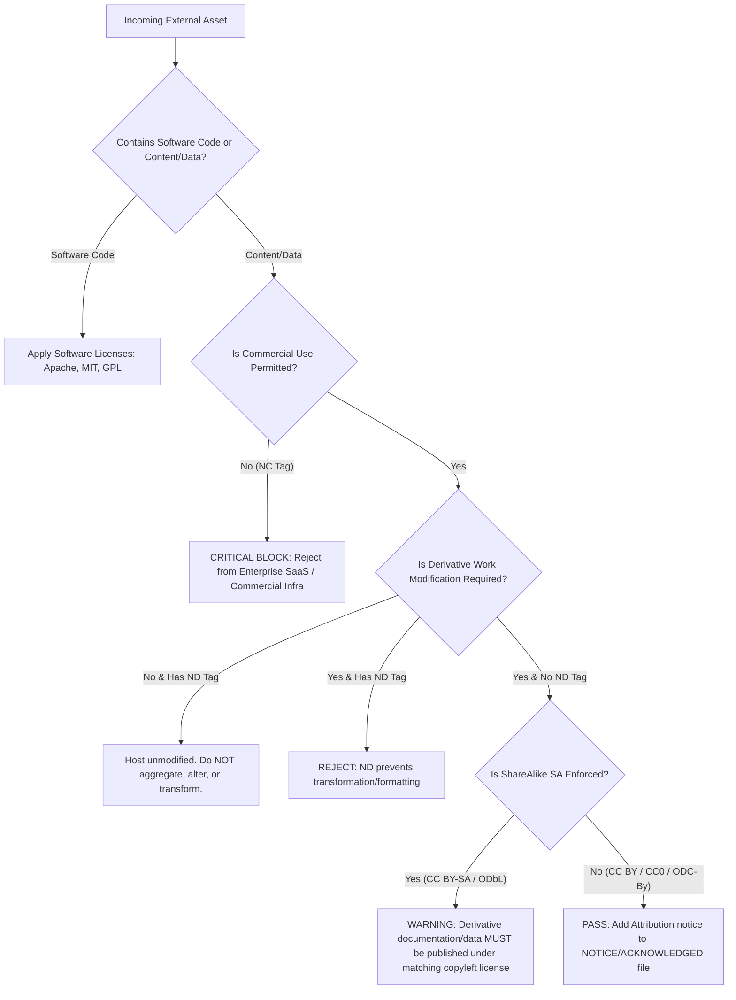

# LPI 050-100: Open Source Essentials — Topic 3.1: Concepts of Open Content Licenses

---

## 1. Production Architectural Problem & Motivation

In modern enterprise platform engineering, SRE, and cloud-native architecture, legal compliance extends far beyond software binary licenses (such as GPL, Apache 2.0, or MIT). Modern platforms process, store, and redistribute vast quantities of non-code assets: infrastructure documentation, API schemas, AI/LLM training datasets, vector database embeddings, Grafana dashboards, Helm chart documentation, and public status pages.

### The Enterprise Risk Profile
Unintentional ingestion or redistribution of improperly licensed content introduces severe operational and legal risks:

1. **Viral ShareAlike (SA) Contamination**: Integrating **CC BY-SA 4.0** (Creative Commons Attribution-ShareAlike) documentation or dataset annotations into proprietary platform documentation or dataset pipelines forces the derivative work to be released under the same copyleft license.
2. **Commercial Enforcement (NC) Violations**: Deploying datasets or platform assets governed by **CC BY-NC 4.0** (NonCommercial) inside revenue-generating SaaS platforms, internal enterprise tools supporting commercial operations, or monetized API endpoints violates the license grant, exposing the organization to copyright infringement litigation.
3. **Derivative Restrictions (ND)**: Using **CC BY-ND 4.0** (NoDerivatives) technical schemas or architecture diagrams in modified forms (e.g., customizing a third-party architectural blueprint for internal deployment) breaches license terms.
4. **Database & Data Licensing Mismatches**: Copyright law in many jurisdictions does not protect raw facts or plain data entries, but database structure and curation are protected under sui generis database rights (notably in the EU). Misapplying standard Creative Commons software/content licenses to relational database dumps or vector stores created under **ODbL (Open Database License)** can lead to structural compliance failures.

---

## 2. Technical Comparatives & Trade-off Tables

### Creative Commons (CC) License Spectrum Matrix

| License Identifier | SPDX ID | Commercial Use | Allow Derivatives | ShareAlike (Copyleft) | Enterprise Risk Level | Typical Production Use Case |
| :--- | :--- | :---: | :---: | :---: | :---: | :--- |
| **Public Domain / CC0** | `CC0-1.0` | Yes | Yes | No | **Minimal** | Open API specs, public telemetry schemas, raw datasets. |
| **Attribution** | `CC-BY-4.0` | Yes | Yes | No | **Low** | Tech blogs, public architecture guides, platform docs. |
| **Attribution-ShareAlike** | `CC-BY-SA-4.0` | Yes | Yes | **Yes** | **Medium-High** | Community wikis, collaborative technical docs (e.g., Wikipedia). |
| **Attribution-NoDerivs** | `CC-BY-ND-4.0` | Yes | **No** | No | **High** | Official standards, regulatory specs, static vendor manuals. |
| **Attribution-NonCommercial** | `CC-BY-NC-4.0` | **No** | Yes | No | **Critical** | Non-profit research papers, academic reference datasets. |
| **Attribution-NC-SA** | `CC-BY-NC-SA-4.0` | **No** | Yes | **Yes** | **Critical** | Educational community tools, non-enterprise reference datasets. |
| **Attribution-NC-ND** | `CC-BY-NC-ND-4.0` | **No** | **No** | No | **Critical** | Brand guidelines, protected media releases. |

### Specialized Open Content & Data Licenses

| License Name | SPDX ID | Primary Scope | Database Right Protection | Copyleft Behavior | Key Architectural Trade-off |
| :--- | :--- | :--- | :---: | :---: | :--- |
| **GNU Free Documentation License** | `GFDL-1.3-only` | Technical Manuals & Software Docs | No | Strong (with Invariant Sections) | Complex to combine with CC-BY-SA; requires preserving Invariant Sections and Cover Texts. |
| **ODC Open Database License** | `ODbL-1.0` | Databases & Data Collections | **Yes** | Strong (Data Level) | Applies copyleft strictly to the data/database layer, independent of application code accessing it. |
| **ODC Attribution License** | `ODC-By-1.0` | Data Collections | **Yes** | No | Permissive data access requiring notice in dataset metadata/headers. |
| **ODC Public Domain Dedication (PDDL)** | `PDDL-1.0` | Databases | **Yes** | No | Relinquishes all rights (including database rights) to raw data sets. |

---

## 3. Production Infrastructure & Compliance Automation Manifests

To enforce license compliance automatically within CI/CD deployment pipelines, platform teams deploy policy-as-code guardrails using **Open Policy Agent (OPA)** and automated asset metadata schemas.

### 3.1 Asset License Metadata Specification (`dataset-manifest.yaml`)

This production manifest defines an ingested dataset asset for an internal ML/Vector pipeline.

```yaml
apiVersion: platform.enterprise.internal/v1alpha1
kind: DataAssetRegistration
metadata:
  name: platform-telemetry-training-set
  namespace: data-engineering
  labels:
    tier: production
    compliance.audit: "true"
spec:
  assetId: "ds-99823-telemetry-v2"
  owner: "sre-platform-team@enterprise.internal"
  sourceUrl: "https://datasets.external.org/telemetry/v2"
  licensing:
    spdxIdentifier: "CC-BY-4.0"
    attributionRequired: true
    attributionNotice: "Contains telemetry models provided by External Org (2025), used under CC BY 4.0."
    commercialUsePermitted: true
    derivativeWorksPermitted: true
    copyleftEnforced: false
  storage:
    bucketUri: "s3://prod-ml-data-assets-us-east-1/telemetry-v2/"
    storageClass: "INTELLIGENT_TIERING"
```

### 3.2 OPA Rego Policy Guardrail (`content_license_policy.rego`)

This Rego policy blocks any dataset or documentation manifest containing non-commercial (`NC`), no-derivatives (`ND`), or strong non-compliant copyleft licenses from being deployed into commercial production Kubernetes clusters.

```rego
package enterprise.governance.licensing

import future.keywords.in

default allow = false

# Permitted licenses for production enterprise infrastructure
allowed_spdx_identifiers := {
    "CC0-1.0",
    "CC-BY-4.0",
    "ODC-By-1.0",
    "PDDL-1.0",
    "MIT",
    "Apache-2.0"
}

# Deny reasons evaluation
deny[msg] {
    input.kind == "DataAssetRegistration"
    license := input.spec.licensing.spdxIdentifier
    not license in allowed_spdx_identifiers
    msg := sprintf("COMPLIANCE VIOLATION: License '%s' in asset '%s' is not in the approved production whitelist.", [license, input.metadata.name])
}

deny[msg] {
    input.kind == "DataAssetRegistration"
    contains(input.spec.licensing.spdxIdentifier, "-NC")
    msg := sprintf("CRITICAL BLOCK: Commercial deployment forbidden for NC-licensed asset '%s'.", [input.metadata.name])
}

deny[msg] {
    input.kind == "DataAssetRegistration"
    contains(input.spec.licensing.spdxIdentifier, "-ND")
    msg := sprintf("POLICY BLOCK: No-Derivatives license prevents processing/transformation for asset '%s'.", [input.metadata.name])
}

deny[msg] {
    input.kind == "DataAssetRegistration"
    input.spec.licensing.attributionRequired == true
    count(input.spec.licensing.attributionNotice) == 0
    msg := sprintf("ATTRIBUTION MISSING: Asset '%s' requires attribution notice string.", [input.metadata.name])
}

# Main authorization decision
allow {
    count(deny) == 0
}
```

### 3.3 GitHub Actions Workflow for Compliance Linting (`license-audit.yaml`)

```yaml
name: Production Asset License Compliance Audit

on:
  push:
    branches: [ "main" ]
  pull_request:
    branches: [ "main" ]

jobs:
  license-compliance-check:
    runs-on: ubuntu-latest
    steps:
      - name: Checkout Code Repository
        uses: actions/checkout@v4

      - name: Install Conftest (OPA Engine)
        run: |
          CONFTEST_VERSION="0.48.0"
          curl -sSF -L "https://github.com/open-policy-agent/conftest/releases/download/v${CONFTEST_VERSION}/conftest_${CONFTEST_VERSION}_Linux_x86_64.tar.gz" | tar xz
          sudo mv conftest /usr/local/bin/

      - name: Install REUSE Tool (FSFE Compliance)
        run: |
          pipx install reuse

      - name: Run REUSE Software & Content Linting
        run: |
          $HOME/.local/bin/reuse lint

      - name: Validate Asset Manifests against Policy
        run: |
          conftest test manifests/ --policy policies/content_license_policy.rego
```

---

## 4. Real CLI Commands and Terminal Outputs

### 4.1 Asset License Scan with `reuse` (Free Software Foundation Europe Compliance Tool)

Execution of automated copyright and license header scanning across documentation and data assets:

```bash
$ reuse lint
```

```text
# Command Output:
# Stocking file information...
# Checking files...

* Summary
  - Bad licenses: 0
  - Deprecated licenses: 0
  - Licenses without file extension: 0
  - Missing licenses: 0
  - Unused licenses: 0
  - Used licenses: CC-BY-4.0, CC0-1.0, MIT
  - Read files: 142
  - Total files: 142

Congratulations! Your project is compliant with the REUSE specification.
```

### 4.2 Detecting Non-Compliant NonCommercial (`NC`) License via `conftest`

Executing OPA validation against a non-compliant asset registration attempting to ingest a `CC-BY-NC-SA-4.0` dataset:

```bash
$ conftest test manifests/invalid-dataset.yaml --policy policies/content_license_policy.rego
```

```text
FAIL - manifests/invalid-dataset.yaml - enterprise/governance/licensing - COMPLIANCE VIOLATION: License 'CC-BY-NC-SA-4.0' in asset 'academic-benchmarks-v1' is not in the approved production whitelist.
FAIL - manifests/invalid-dataset.yaml - enterprise/governance/licensing - CRITICAL BLOCK: Commercial deployment forbidden for NC-licensed asset 'academic-benchmarks-v1'.

2 tests, 0 passed, 0 warnings, 2 failures, 0 exceptions
```

### 4.3 Inspecting License Information in Containerized Data Assets using `syft`

Using `syft` to extract license metadata from a build artifact or container image containing documentation bundles:

```bash
$ syft enterprise.internal/platform/docs-bundle:v2.4.0 -o json | jq '.files[] | select(.path | contains("LICENSE")) | {path: .path, licenses: .evidence.licenses}'
```

```json
{
  "path": "/usr/share/docs/site/LICENSE-CONTENT",
  "licenses": [
    {
      "value": "CC-BY-4.0",
      "spdxExpression": "CC-BY-4.0",
      "type": "concluded"
    }
  ]
}
```

---

## 5. Verification & Troubleshooting Guide

### 5.1 Diagnostic Decision Tree for License Incompatibilities

When merging external content (documentation, database dumps, AI models) into platform pipelines, follow this resolution workflow:



### 5.2 Common Production Compliance Failures and Remediation

#### Issue 1: `ShareAlike (SA)` Contamination in Unified Documentation
* **Symptom**: Legal audit flag indicating that public enterprise documentation repository includes pages copied from a `CC BY-SA 4.0` wiki.
* **Root Cause**: Copyleft virality forces the entire consolidated documentation repository to adopt `CC BY-SA 4.0`.
* **Remediation**:
  1. Isolate the `CC BY-SA 4.0` content into a separate, decoupled sub-domain/repository.
  2. Rewrite the offending section from scratch using internal primary sources under standard enterprise terms or permissive `CC BY 4.0`.
  3. Purge the git commit history if complete removal is mandated by legal counsel.

#### Issue 2: Mixing Relational Database Scrapes with Application APIs (`ODbL` vs `CC-BY`)
* **Symptom**: Ingesting an `ODbL 1.0` database dump into an internal vector database used by a proprietary API.
* **Root Cause**: `ODbL` governs the database layer. Distributing an updated or adapted database triggers the ShareAlike obligation for the database component.
* **Remediation**:
  - Keep the `ODbL` database segregated as a distinct "Produced Work".
  - Ensure API access layers query the database without statically embedding database content inside proprietary binary releases.
  - Publish database modifications publicly if required under `ODbL` section 4.6.

---

## 6. References

* **Linux Professional Institute (LPI) Open Source Essentials**:  
  [https://www.lpi.org/our-certifications/open-source-essentials-overview/](https://www.lpi.org/our-certifications/open-source-essentials-overview/)
* **Creative Commons Official License Index & Legal Code**:  
  [https://creativecommons.org/licenses/](https://creativecommons.org/licenses/)
* **Open Data Commons (ODC) Licenses (ODbL, ODC-By, PDDL)**:  
  [https://opendatacommons.org/licenses/](https://opendatacommons.org/licenses/)
* **GNU Free Documentation License (GFDL v1.3)**:  
  [https://www.gnu.org/licenses/fdl-1.3.html](https://www.gnu.org/licenses/fdl-1.3.html)
* **SPDX License List**:  
  [https://spdx.org/licenses/](https://spdx.org/licenses/)
* **REUSE Specification for Open Source Compliance**:  
  [https://reuse.software/](https://reuse.software/)