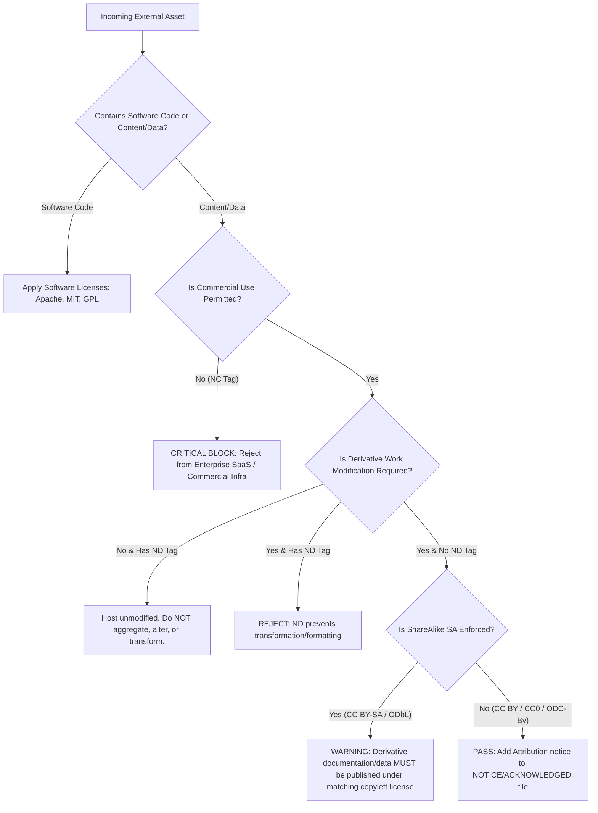

# LPI 050-100: Open Source Essentials — Topic 3.1: Concepts of Open Content Licenses

---

## 1. Problema de Arquitectura de Producción y Motivación

En la ingeniería de plataformas empresarial moderna, SRE y arquitectura cloud-native, el cumplimiento legal se extiende mucho más allá de las licencias de binarios de software (como GPL, Apache 2.0 o MIT). Las plataformas modernas procesan, almacenan y redistribuyen enormes cantidades de activos que no son código: documentación de infraestructura, esquemas API, datasets de entrenamiento de IA/LLM, embeddings de bases de datos vectoriales, dashboards de Grafana, documentación de Helm charts y páginas de estado públicas.

### El Perfil de Riesgo Empresarial
La ingestión o redistribución no intencionada de contenido con licencias inadecuadas introduce severos riesgos operacionales y legales:

1. **Contaminación Viral de ShareAlike (SA)**: Integrar documentación o anotaciones de datasets bajo **CC BY-SA 4.0** (Creative Commons Attribution-ShareAlike) en la documentación de la plataforma propietaria o en los pipelines de datasets obliga a que la obra derivada sea publicada bajo la misma licencia copyleft.
2. **Violaciones de Aplicación Comercial (NC)**: Desplegar datasets o activos de plataforma gobernados por **CC BY-NC 4.0** (NonCommercial) dentro de plataformas SaaS generadoras de ingresos, herramientas empresariales internas que dan soporte a operaciones comerciales o endpoints de API monetizados viola la concesión de la licencia, exponiendo a la organización a litigios por infracción de derechos de autor.
3. **Restricciones de Obras Derivadas (ND)**: Utilizar esquemas técnicos o diagramas de arquitectura bajo **CC BY-ND 4.0** (NoDerivatives) en formas modificadas (por ejemplo, personalizando un plano arquitectónico de terceros para un despliegue interno) incumple los términos de la licencia.
4. **Incompatibilidades en Licenciamiento de Datos y Bases de Datos**: La ley de derechos de autor en muchas jurisdicciones no protege hechos crudos o entradas de datos simples, pero la estructura y curación de la base de datos están protegidas bajo derechos de base de datos sui generis (notablemente en la UE). Aplicar de manera incorrecta licencias estándar de software/contenido de Creative Commons a dumps de bases de datos relacionales o almacenes vectoriales creados bajo **ODbL (Open Database License)** puede llevar a fallos estructurales de cumplimiento.

---

## 2. Comparativas Técnicas y Tablas de Compromisos (Trade-offs)

### Matriz del Espectro de Licencias Creative Commons (CC)

| Identificador de Licencia | SPDX ID | Uso Comercial | Permitir Derivados | ShareAlike (Copyleft) | Nivel de Riesgo Empresarial | Caso de Uso Típico en Producción |
| :--- | :--- | :---: | :---: | :---: | :---: | :--- |
| **Public Domain / CC0** | `CC0-1.0` | Sí | Sí | No | **Mínimo** | Especificaciones de API abiertas, esquemas de telemetría públicos, datasets crudos. |
| **Attribution** | `CC-BY-4.0` | Sí | Sí | No | **Bajo** | Blogs técnicos, guías de arquitectura públicas, docs de plataforma. |
| **Attribution-ShareAlike** | `CC-BY-SA-4.0` | Sí | Sí | **Sí** | **Medio-Alto** | Wikis comunitarias, docs técnicos colaborativos (ej. Wikipedia). |
| **Attribution-NoDerivs** | `CC-BY-ND-4.0` | Sí | **No** | No | **Alto** | Estándares oficiales, especificaciones regulatorias, manuales estáticos de proveedores. |
| **Attribution-NonCommercial** | `CC-BY-NC-4.0` | **No** | Sí | No | **Crítico** | Documentos de investigación sin fines de lucro, datasets de referencia académica. |
| **Attribution-NC-SA** | `CC-BY-NC-SA-4.0` | **No** | Sí | **Sí** | **Crítico** | Herramientas comunitarias educativas, datasets de referencia no empresariales. |
| **Attribution-NC-ND** | `CC-BY-NC-ND-4.0` | **No** | **No** | No | **Crítico** | Guías de marca, comunicados de prensa protegidos. |

### Licencias Especializadas de Contenido Abierto y Datos

| Nombre de Licencia | SPDX ID | Alcance Principal | Protección de Derechos de Base de Datos | Comportamiento Copyleft | Compromiso Arquitectónico Clave (Trade-off) |
| :--- | :--- | :--- | :---: | :---: | :--- |
| **GNU Free Documentation License** | `GFDL-1.3-only` | Manuales Técnicos y Docs de Software | No | Fuerte (con Secciones Invariantes) | Complejo de combinar con CC-BY-SA; requiere preservar Secciones Invariantes y Textos de Cubierta. |
| **ODC Open Database License** | `ODbL-1.0` | Bases de Datos y Colecciones de Datos | **Sí** | Fuerte (a nivel de datos) | Aplica copyleft estrictamente a la capa de datos/base de datos, de forma independiente al código de aplicación que accede a ella. |
| **ODC Attribution License** | `ODC-By-1.0` | Colecciones de Datos | **Sí** | No | Acceso permisivo a datos que requiere aviso en los metadatos/encabezados del dataset. |
| **ODC Public Domain Dedication (PDDL)** | `PDDL-1.0` | Bases de Datos | **Sí** | No | Renuncia a todos los derechos (incluidos los derechos de base de datos) sobre los conjuntos de datos crudos. |

---

## 3. Manifests de Infraestructura de Producción y Automatización de Cumplimiento

Para aplicar el cumplimiento de licencias automáticamente dentro de los pipelines de despliegue CI/CD, los equipos de plataforma despliegan guardrails de policy-as-code utilizando **Open Policy Agent (OPA)** y esquemas automatizados de metadatos de activos.

### 3.1 Especificación de Metadatos de Licencia de Activos (`dataset-manifest.yaml`)

Este manifest de producción define un activo de dataset ingerido para un pipeline interno de ML/Vector.

```yaml
apiVersion: platform.enterprise.internal/v1alpha1
kind: DataAssetRegistration
metadata:
  name: platform-telemetry-training-set
  namespace: data-engineering
  labels:
    tier: production
    compliance.audit: "true"
spec:
  assetId: "ds-99823-telemetry-v2"
  owner: "sre-platform-team@enterprise.internal"
  sourceUrl: "https://datasets.external.org/telemetry/v2"
  licensing:
    spdxIdentifier: "CC-BY-4.0"
    attributionRequired: true
    attributionNotice: "Contains telemetry models provided by External Org (2025), used under CC BY 4.0."
    commercialUsePermitted: true
    derivativeWorksPermitted: true
    copyleftEnforced: false
  storage:
    bucketUri: "s3://prod-ml-data-assets-us-east-1/telemetry-v2/"
    storageClass: "INTELLIGENT_TIERING"
```

### 3.2 Guardrail de Política OPA Rego (`content_license_policy.rego`)

Esta política Rego bloquea cualquier manifest de dataset o documentación que contenga licencias no comerciales (`NC`), sin obras derivadas (`ND`) o copyleft fuerte no conforme para evitar que se desplieguen en clusters de Kubernetes de producción comercial.

```rego
package enterprise.governance.licensing

import future.keywords.in

default allow = false

# Permitted licenses for production enterprise infrastructure
allowed_spdx_identifiers := {
    "CC0-1.0",
    "CC-BY-4.0",
    "ODC-By-1.0",
    "PDDL-1.0",
    "MIT",
    "Apache-2.0"
}

# Deny reasons evaluation
deny[msg] {
    input.kind == "DataAssetRegistration"
    license := input.spec.licensing.spdxIdentifier
    not license in allowed_spdx_identifiers
    msg := sprintf("COMPLIANCE VIOLATION: License '%s' in asset '%s' is not in the approved production whitelist.", [license, input.metadata.name])
}

deny[msg] {
    input.kind == "DataAssetRegistration"
    contains(input.spec.licensing.spdxIdentifier, "-NC")
    msg := sprintf("CRITICAL BLOCK: Commercial deployment forbidden for NC-licensed asset '%s'.", [input.metadata.name])
}

deny[msg] {
    input.kind == "DataAssetRegistration"
    contains(input.spec.licensing.spdxIdentifier, "-ND")
    msg := sprintf("POLICY BLOCK: No-Derivatives license prevents processing/transformation for asset '%s'.", [input.metadata.name])
}

deny[msg] {
    input.kind == "DataAssetRegistration"
    input.spec.licensing.attributionRequired == true
    count(input.spec.licensing.attributionNotice) == 0
    msg := sprintf("ATTRIBUTION MISSING: Asset '%s' requires attribution notice string.", [input.metadata.name])
}

# Main authorization decision
allow {
    count(deny) == 0
}
```

### 3.3 Workflow de GitHub Actions para Linter de Cumplimiento (`license-audit.yaml`)

```yaml
name: Production Asset License Compliance Audit

on:
  push:
    branches: [ "main" ]
  pull_request:
    branches: [ "main" ]

jobs:
  license-compliance-check:
    runs-on: ubuntu-latest
    steps:
      - name: Checkout Code Repository
        uses: actions/checkout@v4

      - name: Install Conftest (OPA Engine)
        run: |
          CONFTEST_VERSION="0.48.0"
          curl -sSF -L "https://github.com/open-policy-agent/conftest/releases/download/v${CONFTEST_VERSION}/conftest_${CONFTEST_VERSION}_Linux_x86_64.tar.gz" | tar xz
          sudo mv conftest /usr/local/bin/

      - name: Install REUSE Tool (FSFE Compliance)
        run: |
          pipx install reuse

      - name: Run REUSE Software & Content Linting
        run: |
          $HOME/.local/bin/reuse lint

      - name: Validate Asset Manifests against Policy
        run: |
          conftest test manifests/ --policy policies/content_license_policy.rego
```

---

## 4. Comandos de CLI Reales y Salidas de Terminal

### 4.1 Escaneo de Licencias de Activos con `reuse` (Herramienta de Cumplimiento de la Free Software Foundation Europe)

Ejecución del escaneo automatizado de encabezados de derechos de autor y licencias en todos los activos de datos y documentación:

```bash
$ reuse lint
```

```text
# Command Output:
# Stocking file information...
# Checking files...

* Summary
  - Bad licenses: 0
  - Deprecated licenses: 0
  - Licenses without file extension: 0
  - Missing licenses: 0
  - Unused licenses: 0
  - Used licenses: CC-BY-4.0, CC0-1.0, MIT
  - Read files: 142
  - Total files: 142

Congratulations! Your project is compliant with the REUSE specification.
```

### 4.2 Detección de Licencias No Comerciales (`NC`) No Conformes mediante `conftest`

Ejecutando la validación de OPA contra un registro de activos no conforme que intenta ingerir un dataset `CC-BY-NC-SA-4.0`:

```bash
$ conftest test manifests/invalid-dataset.yaml --policy policies/content_license_policy.rego
```

```text
FAIL - manifests/invalid-dataset.yaml - enterprise/governance/licensing - COMPLIANCE VIOLATION: License 'CC-BY-NC-SA-4.0' in asset 'academic-benchmarks-v1' is not in the approved production whitelist.
FAIL - manifests/invalid-dataset.yaml - enterprise/governance/licensing - CRITICAL BLOCK: Commercial deployment forbidden for NC-licensed asset 'academic-benchmarks-v1'.

2 tests, 0 passed, 0 warnings, 2 failures, 0 exceptions
```

### 4.3 Inspección de Información de Licencias en Activos de Datos Contenerizados utilizando `syft`

Uso de `syft` para extraer metadatos de licencias de un artefacto de compilación o imagen de contenedor que contiene paquetes de documentación:

```bash
$ syft enterprise.internal/platform/docs-bundle:v2.4.0 -o json | jq '.files[] | select(.path | contains("LICENSE")) | {path: .path, licenses: .evidence.licenses}'
```

```json
{
  "path": "/usr/share/docs/site/LICENSE-CONTENT",
  "licenses": [
    {
      "value": "CC-BY-4.0",
      "spdxExpression": "CC-BY-4.0",
      "type": "concluded"
    }
  ]
}
```

---

## 5. Guía de Verificación y Resolución de Problemas

### 5.1 Árbol de Decisión de Diagnóstico para Incompatibilidades de Licencias

Al fusionar contenido externo (documentación, dumps de bases de datos, modelos de IA) en pipelines de plataforma, siga este flujo de trabajo de resolución:



### 5.2 Fallos Comunes de Cumplimiento en Producción y Remediación

#### Problema 1: Contaminación de `ShareAlike (SA)` en Documentación Unificada
* **Síntoma**: Alerta de auditoría legal que indica que el repositorio público de documentación empresarial incluye páginas copiadas de una wiki con `CC BY-SA 4.0`.
* **Causa Raíz**: La viralidad del copyleft obliga a todo el repositorio consolidado de documentación a adoptar `CC BY-SA 4.0`.
* **Remediación**:
  1. Aislar el contenido `CC BY-SA 4.0` en un subdominio/repositorio separado y desacoplado.
  2. Reescribir la sección en conflicto desde cero utilizando fuentes primarias internas bajo términos empresariales estándar o `CC BY 4.0` permisiva.
  3. Purgar el historial de commits de git si la eliminación completa es exigida por el asesor legal.

#### Problema 2: Mezcla de Scrapes de Bases de Datos Relacionales con APIs de Aplicación (`ODbL` vs `CC-BY`)
* **Síntoma**: Ingestión de un dump de base de datos `ODbL 1.0` en una base de datos vectorial interna utilizada por una API propietaria.
* **Causa Raíz**: `ODbL` rige la capa de la base de datos. Distribuir una base de datos actualizada o adaptada activa la obligación de ShareAlike para el componente de base de datos.
* **Remediación**:
  - Mantener la base de datos `ODbL` segregada como una "Obra Producida" ("Produced Work") distinta.
  - Asegurar que las capas de acceso a la API consulten la base de datos sin incrustar estáticamente el contenido de la base de datos dentro de lanzamientos de binarios propietarios.
  - Publicar las modificaciones de la base de datos públicamente si así lo requiere la sección 4.6 de `ODbL`.

---

## 6. Referencias

* **Linux Professional Institute (LPI) Open Source Essentials**:  
  [https://www.lpi.org/our-certifications/open-source-essentials-overview/](https://www.lpi.org/our-certifications/open-source-essentials-overview/)
* **Creative Commons Official License Index & Legal Code**:  
  [https://creativecommons.org/licenses/](https://creativecommons.org/licenses/)
* **Open Data Commons (ODC) Licenses (ODbL, ODC-By, PDDL)**:  
  [https://opendatacommons.org/licenses/](https://opendatacommons.org/licenses/)
* **GNU Free Documentation License (GFDL v1.3)**:  
  [https://www.gnu.org/licenses/fdl-1.3.html](https://www.gnu.org/licenses/fdl-1.3.html)
* **SPDX License List**:  
  [https://spdx.org/licenses/](https://spdx.org/licenses/)
* **REUSE Specification for Open Source Compliance**:  
  [https://reuse.software/](https://reuse.software/)