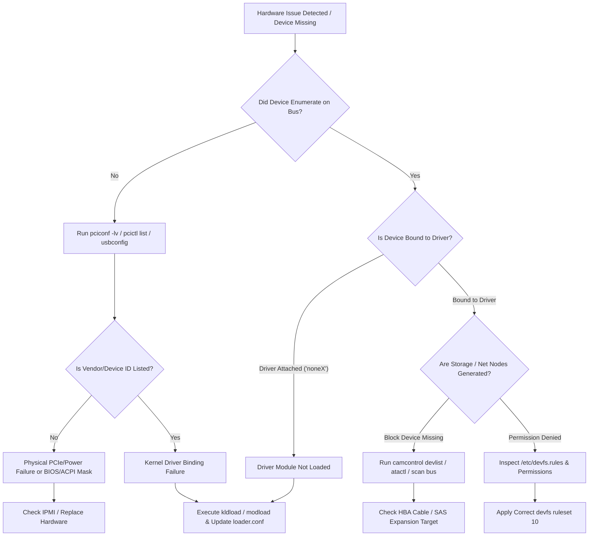

# LPI-702: BSD Specialist Study Guide — Topic 711.4: Hardware Configuration

**Certification:** LPI BSD Specialist (Exam 702-100, Version 1.0)  
**Topic:** 711.4 Hardware Configuration  
**Topic Weight:** 3.33 (Targeted Production Depth)  

---

## 1. Motivation & Production Architectural Problem

### Production Architecture Scenario
In enterprise bare-metal infrastructure—ranging from edge computing platforms to hyper-converged virtualization hosts running FreeBSD, NetBSD, or OpenBSD—predictable hardware initialization, device attachment, and kernel subsystem management are critical for operational stability. Unlike containerized or virtualized ephemeral workloads, bare-metal BSD deployments interact directly with physical silicon: PCIe root complexes, NVMe storage controllers, NUMA memory nodes, IPMI/BMC interfaces, and SR-IOV network interfaces.

A primary architectural challenge in high-availability BSD environments is ensuring that the operating system correctly probes, enumerates, and attaches appropriate drivers during system boot, while maintaining secure control over dynamically loaded kernel code. 

```
                                    +------------------------------------------+
                                    |          Hardware Bus Complex            |
                                    |   PCIe Root / USB Controllers / SATA /   |
                                    |                NVMe / IPMI               |
                                    +--------------------+---------------------+
                                                         |
                                                         v
                                    +--------------------+---------------------+
                                    |     Kernel Boot Probing & ACPI Enumeration |
                                    |           (autoconf(9) Subsystem)        |
                                    +--------------------+---------------------+
                                                         |
                                    +--------------------+---------------------+
                                    |  Device Driver Attachment & Resource Alloc|
                                    |     (IRQs, Memory Mapped I/O, DMA)       |
                                    +--------------------+---------------------+
                                                         |
                   +-------------------------------------+-------------------------------------+
                   |                                                                           |
                   v                                                                           v
+------------------+-------------------+                                    +------------------+-------------------+
| FreeBSD Dynamic KLD Subsystem        |                                    | OpenBSD Monolithic / KARL Security|
| (kldload / loader.conf / devd)       |                                    | (Static Link / Kernel Randomization|
+------------------+-------------------+                                    +------------------+-------------------+
                   |                                                                           |
                   v                                                                           v
+------------------+-------------------+                                    +------------------+-------------------+
| Dynamic /dev Node Generation         |                                    | Static or Hotplug Daemon Enforced |
| (devfs rulesets & dynamic access)    |                                    | (/dev Nodes & Securelevel Bounds) |
+--------------------------------------+                                    +-----------------------------------+
```

### Architectural Mechanics & Failure Modes
1. **Device Probing (`autoconf(9)`)**: During kernel boot, the BSD device configuration framework probes hardware buses (PCI, USB, ISA, SCSI, ATA). If a driver fails to match a device's PCI Vendor/Device ID or fails its initialization routine, the hardware is left unattached (`unnamed` or unconfigured device node), leading to silent storage or network path outages.
2. **Dynamic Kernel Modules vs. Security Profiles**:
   - **FreeBSD (KLD)**: Uses the Kernel Linker (`kldload`, `kldunload`, `/boot/loader.conf`) allowing post-boot runtime driver updates and modular virtualization. However, unconstrained kernel module loading presents attack vector risks if untrusted binaries execute at ring 0.
   - **OpenBSD (Monolithic / KARL)**: Prefers a monolithic kernel architecture with Kernel Address Randomized Link (KARL), re-linking a custom kernel binary upon boot. Dynamic module loading is disabled at higher `securelevel` settings (e.g., `securelevel >= 1`).
   - **NetBSD (Modular)**: Features a dynamic module loader (`modload`, `modstat`) structured around explicit module dependency graphs.
3. **Storage Access Abstraction**: High-performance NVMe and SATA disks rely on storage layer abstractions (e.g., FreeBSD CAM - Common Access Method). Improper bus scanning or missing HBA driver definitions prevent block device node creation under `/dev`.
4. **Hotplug Daemon Infrastructure (`devd`)**: When hardware components (USB interfaces, hot-swappable NVMe drives, PCIe SR-IOV virtual functions) enter or exit the system, event daemons must capture low-level kernel event notifications and dynamically apply driver parameters, network interface rename rules, or devfs permission masks.

---

## 2. Technical Comparisons & Trade-Off Matrix

### 2.1 Hardware Subsystem Architecture Across BSD Variants

| Architectural Metric | FreeBSD | NetBSD | OpenBSD |
| :--- | :--- | :--- | :--- |
| **PCI Inspection Utility** | `pciconf` (`pciconf -lv`) | `pcictl` (`pcictl /dev/pci0 list`) | `sysctl` / `dmesg` / `pcidump` |
| **Storage Subsystem Control** | `camcontrol` (SCSI/SATA/NVMe) | `atactl`, `scsictl` | `atactl`, `scsi`, `bioctl` |
| **Device Tree Inspection** | `devinfo` (`devinfo -u`, `devinfo -r`) | `drvctl` (`drvctl -l`) | `sysctl hw.` |
| **Kernel Module Subsystem** | KLD (`kldload`, `kldstat`, `kldunload`) | LKM/Modular (`modload`, `modstat`, `modunload`) | Monolithic / Re-linked (Disabled if `securelevel` > 0) |
| **Boot Module Preloading** | `/boot/loader.conf` | `/boot.cfg` | `/etc/boot.conf` (static kernel) |
| **Hotplug Manager** | `devd` | `devpubd` | `hotplugd` |
| **Device Node Management** | `devfs` (Dynamic with rulesets) | `devfs` / static `MAKEDEV` | static `MAKEDEV` |

### 2.2 Kernel Module Management Subsystems

```
FreeBSD (KLD System):
  [ /boot/loader.conf ]  ---> Loader ---> Preloads Kernel + .ko Modules into Memory
  [ kldload / kldunload ] ---> Kernel Linker Interface ---> Dyn-Links Module into Running Kernel

NetBSD (LKM System):
  [ /etc/modules.conf ]  ---> System Initialization ---> Executes modload
  [ modload / modunload ] ---> /dev/ksyms Linker ---> Loads ELF Module into Kernel Space

OpenBSD (KARL System):
  [ Re-link at Boot ]    ---> Generates Unique Kernel Binary ---> Boots Monolithic Kernel
  [ securelevel >= 1 ]   ---> Disallows Dynamic Module Ingestion Completely
```

| Dimension | FreeBSD KLD Subsystem | NetBSD Module Subsystem | OpenBSD Monolithic / KARL |
| :--- | :--- | :--- | :--- |
| **Security Stance** | High flexibility; controlled via `kern.securelevel` and signature requirements. | High flexibility; modular kernel base with explicit runtime loading. | Maximum security hardening; kernel randomized at boot; no runtime module insertion in standard operation. |
| **Runtime Upgradability**| Excellent; live reload of network/storage drivers without reboot. | High; modules loaded via `modload` or automated daemon attachment. | None; requires system reboot to execute newly linked kernel image. |
| **Performance Overhead**| Zero runtime call penalty; direct function pointer resolve. | Minimal overhead; symbol table maintained via `/dev/ksyms`. | Optimal cache efficiency and memory layout due to unified kernel image compilation. |
| **Production Risk** | Potential kernel panic if module compiled against mismatched kernel ABI version. | Require strict module layout versioning matching kernel binary build. | Eliminates runtime kernel injection vulnerabilities entirely. |

---

## 3. Production Infrastructure & Configuration Manifests

### 3.1 FreeBSD Bootloader Hardware Configuration (`/boot/loader.conf`)
This manifest configures kernel pre-boot loading, PCIe tuning, network card driver attachment, and NUMA topology settings for a dual-socket bare-metal FreeBSD hypervisor host.

```ini
# ==============================================================================
# FreeBSD Bare-Metal Hypervisor / Bootloader Hardware Tuning
# Path: /boot/loader.conf
# Syntax: FreeBSD loader environment parameters
# ==============================================================================

# Kernel Execution & Verbose Probing
autoboot_delay="3"
verbose_loading="YES"
boot_verbose="YES"

# Microcode & Processor Hardware Updates
cpu_microcode_load="YES"
cpu_microcode_name="/boot/firmware/intel-ucode.bin"

# Network Controller Drivers (PCIe Attachments)
if_ixgbe_load="YES"             # Intel 10GbE PCI Driver
if_mlx5en_load="YES"            # Mellanox ConnectX-4/5/6 25/100GbE Driver

# Storage Controller & NVMe Subsystem Preloading
nvme_load="YES"                 # Non-Volatile Memory Express Driver
nvd_load="YES"                  # NVMe Block Device Driver
mpr_load="YES"                  # LSI SAS3/Modular Storage HBA Driver

# Advanced Hardware & Virtualization Extensions
vmm_load="YES"                  # bhyve Hypervisor Core Module
nmdm_load="YES"                 # Null-Modem Interface (Console Redirection)
ppt_load="YES"                  # PCI Passthrough Driver Subsystem

# Resource Limits & Hardware Topology Tuning
hw.nvme.per_cpu_io_queues="1"   # Allocate per-CPU IO Queue for NVMe drives
hw.ixgbe.rxd="4096"             # RX Descriptors per Ring (Intel 10G)
hw.ixgbe.txd="4096"             # TX Descriptors per Ring (Intel 10G)
vm.phys_loc="1"                 # NUMA Topology Awareness Optimization

# ACPI & Power Management Settings
hint.acpi_throttle.0.disabled="1"   # Disable legacy CPU throttling (Use C-states)
performance_cpu_freq="HIGH"         # Default to maximum CPU performance state
```

---

### 3.2 FreeBSD Device Hotplug Daemon Configuration (`/etc/devd.conf`)
This configuration file manages hardware hotplug events. It detects when a USB network adapter or PCIe card is inserted/removed and automatically triggers hardware configuration scripts and syslog telemetry.

```conf
# ==============================================================================
# FreeBSD Hardware Event Daemon Configuration
# Path: /etc/devd.conf
# Syntax: devd.conf language specification
# ==============================================================================

options {
    directory "/etc/devd";
    directory "/usr/local/etc/devd";
    pid-file "/var/run/devd.pid";
    set scsi-device-timeout 30;
};

# Capture USB Network Interface Attachment
attach 100 {
    device-name "ue[0-9]+";
    match "vendor" "0x0b95"; # ASIX Electronics USB Ethernet
    action "/sbin/dhclient $device-name; /usr/bin/logger -t devd 'USB Ethernet Attached: $device-name'";
};

# Capture PCIe Storage Device Attachment/Detachment Events
notify 50 {
    match "system"      "CAM";
    match "subsystem"   "PERIPHERAL";
    match "type"        "ERRORS";
    action "/usr/bin/logger -p daemon.crit -t devd-cam 'CAM Peripheral Error on $device: $reason'";
};

# Automatic Network Interface Detach Cleanup
detach 100 {
    device-name "ue[0-9]+";
    action "/sbin/ifconfig $device-name destroy; /usr/bin/logger -t devd 'USB Ethernet Detached: $device-name'";
};

# ACPI Power Button Hard Shutdown Intercept
event {
    category "ACPI";
    subsystem "Button";
    detail "Power";
    action "/sbin/shutdown -h now 'Power Button Pressed'";
};
```

---

### 3.3 FreeBSD Device File System Ruleset (`/etc/devfs.rules`)
This manifest establishes explicit permission control over physical hardware nodes generated under `/dev`, enforcing security boundaries for non-root users and jail environments accessing PCI passthrough and raw storage.

```ini
# ==============================================================================
# FreeBSD Dynamic DevFS Rule Specification
# Path: /etc/devfs.rules
# Syntax: devfs.rules format specification
# ==============================================================================

[system_hardware_access=10]
# Reset default devfs tree rules
add hide

# Expose critical system terminals and null devices
add path null unhide
add path zero unhide
add path random unhide
add path urandom unhide
add path tty* unhide

# Direct NVMe & Pass-through Controller Access for Monitoring Daemons
add path 'nvme*' mode 0660 group operator unhide
add path 'nvd*' mode 0660 group operator unhide
add path 'pass*' mode 0660 group operator unhide

# USB Device Node Access for Hardware Tokens and Management
add path 'usb/*' mode 0660 group operator unhide
add path 'ugen*' mode 0660 group operator unhide

[jail_hardware_passthrough=20]
# Devfs ruleset for hardware-isolated FreeBSD Containers (Jails)
add include $devfsrules_hide_all
add path null unhide
add path zero unhide
add path 'bpf*' unhide mode 0680 owner root
add path 'crypto*' unhide mode 0666
```

---

### 3.4 Ansible Automation Infrastructure Playbook
This playbook standardizes bare-metal hardware discovery, enforces required kernel module states, and verifies device configurations across BSD fleets.

```yaml
---
# ==============================================================================
# Ansible Automation Playbook: BSD Hardware Audit & Module Enforcement
# Architecture: Bare-Metal Infrastructure Management (FreeBSD / NetBSD)
# ==============================================================================
- name: Audit and Configure Bare-Metal Hardware Subsystems
  hosts: bsd_baremetal
  gather_facts: yes
  become: yes

  tasks:
    - name: Ensure FreeBSD Kernel Modules are Enabled in loader.conf
      when: ansible_os_family == "FreeBSD"
      ansible.builtin.lineinfile:
        path: /boot/loader.conf
        regexp: "^#?{{ item.key }}="
        line: '{{ item.key }}="{{ item.value }}"'
        create: yes
        state: present
      loop:
        - { key: 'nvme_load', value: 'YES' }
        - { key: 'nvd_load', value: 'YES' }
        - { key: 'if_ixgbe_load', value: 'YES' }

    - name: Load Runtime Kernel Modules on FreeBSD
      when: ansible_os_family == "FreeBSD"
      community.general.kld:
        name: "{{ item }}"
        state: present
      loop:
        - nvme
        - nvd
        - if_ixgbe

    - name: Query PCI Hardware Devices via Shell Command (FreeBSD)
      when: ansible_os_family == "FreeBSD"
      ansible.builtin.command: pciconf -lv
      register: pci_output_freebsd
      changed_when: false

    - name: Query PCI Hardware Devices via Shell Command (NetBSD)
      when: ansible_os_family == "NetBSD"
      ansible.builtin.command: pcictl /dev/pci0 list
      register: pci_output_netbsd
      changed_when: false

    - name: Verify NVMe Controller Attachment
      ansible.builtin.assert:
        that:
          - "'nvme' in pci_output_freebsd.stdout or 'PCIe Storage' in pci_output_netbsd.stdout"
        fail_msg: "CRITICAL: Primary NVMe Storage Controller not recognized by OS hardware bus!"
        success_msg: "Hardware storage controller correctly detected."
```

---

## 4. CLI Execution & Realistic Terminal Output

### 4.1 System Boot Message Analysis (`dmesg`)
Inspect the kernel message buffer to trace hardware probing, driver identification, and resource attachment.

```console
$ dmesg | head -n 30
[1.000000] FreeBSD is a registered trademark of The FreeBSD Foundation.
[1.000000] FreeBSD 14.0-RELEASE-p5 #0 releng/14.0-n265380-f0026e69fd7c: Fri Feb  9 08:34:04 UTC 2024
[1.000000] CPU: Intel(R) Xeon(R) Gold 6338 CPU @ 2.00GHz (1995.34-MHz K8-class CPU)
[1.000000]   Origin="GenuineIntel"  Id=0x606c1  Stepping=1
[1.000000]   Features=0xbfebfbff<FPU,VME,DE,PSE,TSC,MSR,PAE,MCE,CX8,APIC,SEP,MTRR,PGE,MCA,CMOV,PAT,PSE36,CLFLUSH,DTS,ACPI,MMX,FXSR,SSE,SSE2,SS,HTT,TM,PBE>
[1.000000] hypervisor=BHYVE
[1.000000] Real Memory  = 68719476736 (65536 MB)
[1.000000] AVAIL MEMORY = 67012358144 (63908 MB)
[1.000000] System Management BIOS version 3.3 support present.
[1.000005] devfs: table size 1024 max nodes 16384
[1.000010] pci0: <PCI bus> on pcib0
[1.000015] pci0: <network, ethernet> at device 0.0 (id=8086:1572 sub=8086:0000) rx_ring 4096 tx_ring 4096
[1.000020] ix0: <Intel(R) PRO/10GbE PCI-Express Network Driver> port 0x1000-0x101f mem 0x91800000-0x919fffff,0x91a00000-0x91a03fff irq 16 at device 0.0 on pci0
[1.000022] ix0: Using 8 MSI-X vectors
[1.000025] ix0: Ethernet address: 52:54:00:fa:91:12
[1.000030] nvme0: <Generic NVMe Controller> mem 0x91500000-0x91503fff irq 17 at device 1.0 on pci0
[1.000032] nvd0: <INTEL SSDPF2KX038TZ> NVMe storage device
[1.000035] nvd0: 3623878MB (7421703680 512 byte sectors)
```

---

### 4.2 FreeBSD PCI Bus Inspection (`pciconf`)
Examine the PCIe device tree, vendor IDs, device IDs, bus placement, and driver bindings.

```console
$ pciconf -lv
hostb0@pci0:0:0:0:      class=0x060000 rev=0x02 hdr=0x00 vendor=0x8086 device=0x9b43 subvendor=0x1028 subdevice=0x0981
    vendor     = 'Intel Corporation'
    device     = '10th Gen Core Processor Host Bridge/DRAM Registers'
    class      = bridge
    subclass   = HOST-PCI
ix0@pci0:0:31:0:        class=0x020000 rev=0x01 hdr=0x00 vendor=0x8086 device=0x1572 subvendor=0x8086 subdevice=0x0000
    vendor     = 'Intel Corporation'
    device     = 'Ethernet Controller X710 for 10GbE SFP+'
    class      = network
    subclass   = ethernet
nvme0@pci0:1:0:0:       class=0x010802 rev=0x00 hdr=0x00 vendor=0x8086 device=0x0953 subvendor=0x8086 subdevice=0x3702
    vendor     = 'Intel Corporation'
    device     = 'PCIe Data Center SSD NVMe'
    class      = mass storage
    subclass   = NVM
none0@pci0:2:0:0:      class=0x030000 rev=0x04 hdr=0x00 vendor=0x10de device=0x2204 subvendor=0x1458 subdevice=0x403c
    vendor     = 'NVIDIA Corporation'
    device     = 'GA102 [GeForce RTX 3090]'
    class      = display
    subclass   = VGA
```
> **Diagnostic Note**: Device `none0` indicates that hardware is present on the PCIe bus (`vendor=0x10de device=0x2204`), but **no kernel driver has attached to it**.

---

### 4.3 Storage Subsystem Interrogation (`camcontrol` & `atactl`)

#### FreeBSD CAM Subsystem Query (`camcontrol`):
```console
$ camcontrol devlist -v
<INTEL SSDPF2KX038TZ 2DV10101>      at scbus0 target 0 lun 1 (pass0,nvd0)
<Dell EMC HBA330 Adp 16.17.01.00>   at scbus1 target 0 lun 0 (pass1,mpr0)
<SEAGATE ST1200MM0009 NT04>         at scbus1 target 2 lun 0 (pass2,da0)
<SEAGATE ST1200MM0009 NT04>         at scbus1 target 3 lun 0 (pass3,da1)

$ camcontrol inquiry scbus1 target 2 lun 0
Pass-through device: pass2
Device type:         Direct Access SCSI Device
Vendor:              SEAGATE 
Device:              ST1200MM0009    
Revision:            NT04
Serial Number:       ZWN0A94V
Protocol:            SAS
Capabilities:        Command Queueing, 16-bit Wide Transfers
```

#### NetBSD ATA Subsystem Inspection (`atactl`):
```console
$ atactl /dev/atabus0 device
Device 0:
  Model: WDC WD1003FZEX-00MK2A0
  Capacity: 1000 GB (244190640 sectors)
  SATA Transport: SATA-3.0 (6.0 Gb/s)
  Feature Support: SMART, NCQ, LBA48, APM
```

---

### 4.4 FreeBSD Kernel Module Operations (`kldstat`, `kldload`, `kldunload`)

#### Step 1: Query currently loaded kernel modules
```console
$ kldstat
Id Refs Address            Size     Name
 1   26 0xffffffff80200000 2167d40  kernel
 2    1 0xffffffff82368000 8190     if_ixgbe.ko
 3    1 0xffffffff82371000 1a480    nvme.ko
 4    1 0xffffffff8238c000 95f0     nvd.ko
```

#### Step 2: Dynamically load a kernel module (`nvidia.ko`)
```console
$ sudo kldload nvidia
$ kldstat | grep nvidia
 5    1 0xffffffff82396000 1e428b0  nvidia.ko
 6    2 0xffffffff841d9000 12050    linuxkpi.ko
```

#### Step 3: Inspect hardware binding update via `pciconf`
```console
$ pciconf -lv -u | grep -A 4 nvidia0
nvidia0@pci0:2:0:0:     class=0x030000 rev=0x04 hdr=0x00 vendor=0x10de device=0x2204 subvendor=0x1458 subdevice=0x403c
    vendor     = 'NVIDIA Corporation'
    device     = 'GA102 [GeForce RTX 3090]'
    class      = display
    subclass   = VGA
```

#### Step 4: Unload kernel module cleanly
```console
$ sudo kldunload nvidia
$ kldstat -m nvidia
kldstat: can't find module nvidia: No such file or directory
```

---

### 4.5 NetBSD Kernel Module Operations (`modstat`, `modload`, `modunload`)

```console
$ modstat
NAME                    CLASS    SOURCE   REV    REFS SIZE     REQUIRES
smbfs                   vfs      filesys  500    0    38k      -
exec_elf64              exec     builtin  -      0    -        -
compat_netbsd16         compat   builtin  -      0    -        -

$ sudo modload /usr/mdec/modules/tmpfs/tmpfs.kmod
$ modstat | grep tmpfs
tmpfs                   vfs      module   500    1    24k      -

$ sudo modunload tmpfs
$ modstat | grep tmpfs
(empty output)
```

---

### 4.6 USB Subsystem Enumeration (`usbconfig`)
Query connected USB controllers and device properties in FreeBSD.

```console
$ usbconfig list
ugen0.1: <Intel EHCI root HUB> at usbus0, cfg=0 md=HOST spd=HIGH (480Mbps) pwr=SAVE (0mA)
ugen1.1: <xHCI root HUB> at usbus1, cfg=0 md=HOST spd=SUPER (5Gbps) pwr=SAVE (0mA)
ugen1.2: <American Power Conversion Smart-UPS 1500> at usbus1, cfg=0 md=HOST spd=FULL (12Mbps) pwr=ON (100mA)

$ usbconfig -d ugen1.2 dump_device_desc
ugen1.2: <American Power Conversion Smart-UPS 1500> at usbus1
  bLength = 0x0012 
  bDescriptorType = 0x0001 
  bcdUSB = 0x0200 
  bDeviceClass = 0x0000  <Specified at interface level>
  bDeviceSubClass = 0x0000 
  bDeviceProtocol = 0x0000 
  bMaxPacketSize0 = 0x0040 
  idVendor = 0x051d 
  idProduct = 0x0002 
  bcdDevice = 0x0006 
  iManufacturer = 0x0001  <American Power Conversion>
  iProduct = 0x0002  <Smart-UPS 1500>
  iSerialNumber = 0x0003  <AS1824142109>
  bNumConfigurations = 0x0001 
```

---

## 5. Verification & Troubleshooting Guide

### 5.1 Hardware Diagnostic Flowchart



---

### 5.2 Step-by-Step Production Troubleshooting Scenarios

#### Scenario A: PCIe Device Enumerates as `noneX` (Missing Driver)
* **Symptom**: Network card or GPU is detected on PCIe bus, but no network interface (`ix0`, `mlx5`) is created.
* **Diagnosis Steps**:
  1. Inspect PCI device attachment status:
     ```console
     $ pciconf -lv | grep -B 2 -A 4 "none"
     ```
  2. Extract Vendor ID and Device ID: `vendor=0x8086 device=0x1572`.
  3. Query available kernel modules for driver match:
     ```console
     $ kldstat -v | grep 1572
     ```
  4. Manually trigger module loading:
     ```console
     $ sudo kldload if_ixgbe
     ```
  5. Confirm device attachment:
     ```console
     $ dmesg | tail -n 10 | grep ix0
     ix0: <Intel(R) PRO/10GbE PCI-Express Network Driver> attached to pci0:0:31:0
     ```

---

#### Scenario B: SAS Hard Drive Not Visible in `/dev` (CAM Subsystem Timeout)
* **Symptom**: New SAS drive inserted into hot-swap drive bay is not available under `/dev/da4`.
* **Diagnosis Steps**:
  1. Check CAM device list to see if pass-through device exists:
     ```console
     $ camcontrol devlist
     ```
  2. Rescan the SCSI/SAS HBA bus:
     ```console
     $ sudo camcontrol rescan all
     Re-scanning all SCSI buses
     ```
  3. Verify bus controller messages:
     ```console
     $ dmesg | grep -i cam
     (da4:mpr0:0:4:0): Direct Access SCSI SAS-3 Device
     (da4:mpr0:0:4:0): 1200MB/s transfers
     (da4:mpr0:0:4:0): 1144733MB (2344416480 512 byte sectors)
     ```

---

#### Scenario C: `kldload` Fails with "Operation not permitted"
* **Symptom**: System administrator attempts to load a kernel module on a hardened FreeBSD server, but the shell returns an error.
* **Diagnosis Steps**:
  1. Attempt module load:
     ```console
     $ sudo kldload accf_http
     kldload: can't load accf_http: Operation not permitted
     ```
  2. Check current kernel `securelevel`:
     ```console
     $ sysctl kern.securelevel
     kern.securelevel: 1
     ```
  3. **Root Cause Analysis**: At `securelevel >= 1`, FreeBSD disables loading or unloading kernel modules to prevent kernel memory mutation.
  4. **Resolution**: Add `accf_http_load="YES"` to `/boot/loader.conf` and reboot system, or lower `securelevel` in `/etc/rc.conf` prior to boot.

---

## 6. References

- **Linux Professional Institute (LPI) BSD Specialist Overview**:  
  https://www.lpi.org/our-certifications/bsd-specialist-overview/
- **FreeBSD Architecture & Hardware Configuration Handbook**:  
  https://docs.freebsd.org/en/books/handbook/config/
- **FreeBSD Manual Page - `pciconf(8)`**:  
  https://man.freebsd.org/cgi/man.cgi?query=pciconf
- **FreeBSD Manual Page - `camcontrol(8)`**:  
  https://man.freebsd.org/cgi/man.cgi?query=camcontrol
- **FreeBSD Manual Page - `devd.conf(5)`**:  
  https://man.freebsd.org/cgi/man.cgi?query=devd.conf
- **NetBSD Hardware & Kernel Module Documentation**:  
  https://www.netbsd.org/docs/guide/en/chap-kernel.html
- **OpenBSD Manual Page - `atactl(8)`**:  
  https://man.openbsd.org/atactl.8