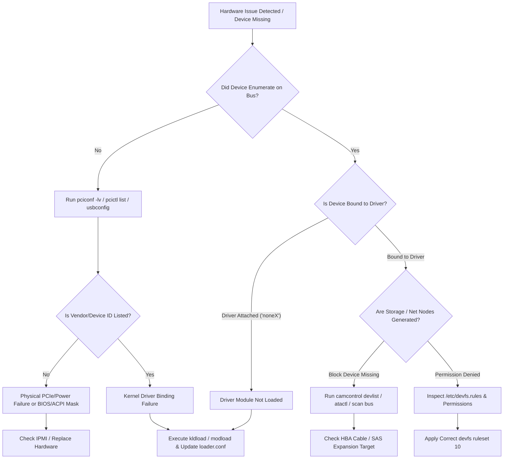

# LPI-702: Guía de estudio para especialista BSD — Tema 711.4: Configuración de hardware

**Certificación:** LPI BSD Specialist (Examen 702-100, Versión 1.0)  
**Tema:** 711.4 Configuración de hardware  
**Peso del tema:** 3.33 (Profundidad de producción orientada)  

---

## 1. Motivación y problema arquitectónico en producción

### Escenario de arquitectura en producción
En la infraestructura bare-metal empresarial—que abarca desde plataformas de edge computing hasta hosts de virtualización hiperconvergente que ejecutan FreeBSD, NetBSD u OpenBSD—la inicialización predecible del hardware, el acoplamiento (attachment) de dispositivos y la gestión de los subsistemas del kernel son críticos para la estabilidad operativa. A diferencia de las cargas de trabajo efímeras virtualizadas o en contenedores, los despliegues BSD en bare-metal interactúan directamente con el silicio físico: root complexes PCIe, controladores de almacenamiento NVMe, nodos de memoria NUMA, interfaces IPMI/BMC e interfaces de red SR-IOV.

Un desafío arquitectónico principal en entornos BSD de alta disponibilidad es garantizar que el sistema operativo sondee (probe), enumere y acople correctamente los drivers apropiados durante el arranque del sistema, manteniendo al mismo tiempo un control seguro sobre el código del kernel cargado dinámicamente. 

```
                                    +------------------------------------------+
                                    |          Hardware Bus Complex            |
                                    |   PCIe Root / USB Controllers / SATA /   |
                                    |                NVMe / IPMI               |
                                    +--------------------+---------------------+
                                                         |
                                                         v
                                    +--------------------+---------------------+
                                    |     Kernel Boot Probing & ACPI Enumeration |
                                    |           (autoconf(9) Subsystem)        |
                                    +--------------------+---------------------+
                                                         |
                                    +--------------------+---------------------+
                                    |  Device Driver Attachment & Resource Alloc|
                                    |     (IRQs, Memory Mapped I/O, DMA)       |
                                    +--------------------+---------------------+
                                                         |
                   +-------------------------------------+-------------------------------------+
                   |                                                                           |
                   v                                                                           v
+------------------+-------------------+                                    +------------------+-------------------+
| FreeBSD Dynamic KLD Subsystem        |                                    | OpenBSD Monolithic / KARL Security|
| (kldload / loader.conf / devd)       |                                    | (Static Link / Kernel Randomization|
+------------------+-------------------+                                    +------------------+-------------------+
                   |                                                                           |
                   v                                                                           v
+------------------+-------------------+                                    +------------------+-------------------+
| Dynamic /dev Node Generation         |                                    | Static or Hotplug Daemon Enforced |
| (devfs rulesets & dynamic access)    |                                    | (/dev Nodes & Securelevel Bounds) |
+--------------------------------------+                                    +-----------------------------------+
```

### Mecánica arquitectónica y modos de fallo
1. **Sondeo de dispositivos (`autoconf(9)`)**: Durante el arranque del kernel, el framework de configuración de dispositivos de BSD sondea los buses de hardware (PCI, USB, ISA, SCSI, ATA). Si un driver no logra coincidir con el PCI Vendor/Device ID de un dispositivo o falla en su rutina de inicialización, el hardware queda desacoplado (nodo de dispositivo `unnamed` o no configurado), lo que provoca interrupciones silenciosas en las rutas de almacenamiento o red.
2. **Módulos dinámicos del kernel vs. perfiles de seguridad**:
   - **FreeBSD (KLD)**: Utiliza el Kernel Linker (`kldload`, `kldunload`, `/boot/loader.conf`), lo que permite actualizaciones de drivers en tiempo de ejecución posteriores al arranque y virtualización modular. Sin embargo, la carga sin restricciones de módulos del kernel presenta riesgos de vectores de ataque si se ejecutan binarios no confiables en el ring 0.
   - **OpenBSD (Monolítico / KARL)**: Prefiere una arquitectura de kernel monolítico con Kernel Address Randomized Link (KARL), re-enlazando un binario de kernel personalizado en cada arranque. La carga dinámica de módulos está deshabilitada en niveles de `securelevel` más altos (por ejemplo, `securelevel >= 1`).
   - **NetBSD (Modular)**: Cuenta con un cargador dinámico de módulos (`modload`, `modstat`) estructurado en torno a grafos explícitos de dependencias de módulos.
3. **Abstracción de acceso al almacenamiento**: Los discos NVMe y SATA de alto rendimiento dependen de abstracciones en la capa de almacenamiento (por ejemplo, FreeBSD CAM - Common Access Method). Un escaneo de bus incorrecto o definiciones faltantes del driver HBA impiden la creación de nodos de dispositivos de bloque bajo `/dev`.
4. **Infraestructura del demonio de hotplug (`devd`)**: Cuando los componentes de hardware (interfaces USB, unidades NVMe intercambiables en caliente, funciones virtuales PCIe SR-IOV) ingresan o salen del sistema, los demonios de eventos deben capturar las notificaciones de eventos de bajo nivel del kernel y aplicar dinámicamente parámetros de drivers, reglas de renombrado de interfaces de red o máscaras de permisos de devfs.

---

## 2. Comparativas técnicas y matriz de compensaciones (Trade-Off Matrix)

### 2.1 Arquitectura del subsistema de hardware a través de las variantes de BSD

| Métrica arquitectónica | FreeBSD | NetBSD | OpenBSD |
| :--- | :--- | :--- | :--- |
| **Utilidad de inspección PCI** | `pciconf` (`pciconf -lv`) | `pcictl` (`pcictl /dev/pci0 list`) | `sysctl` / `dmesg` / `pcidump` |
| **Control del subsistema de almacenamiento** | `camcontrol` (SCSI/SATA/NVMe) | `atactl`, `scsictl` | `atactl`, `scsi`, `bioctl` |
| **Inspección del árbol de dispositivos** | `devinfo` (`devinfo -u`, `devinfo -r`) | `drvctl` (`drvctl -l`) | `sysctl hw.` |
| **Subsistema de módulos del kernel** | KLD (`kldload`, `kldstat`, `kldunload`) | LKM/Modular (`modload`, `modstat`, `modunload`) | Monolítico / Re-enlazado (Deshabilitado si `securelevel` > 0) |
| **Precarga de módulos en el arranque** | `/boot/loader.conf` | `/boot.cfg` | `/etc/boot.conf` (kernel estático) |
| **Gestor de Hotplug** | `devd` | `devpubd` | `hotplugd` |
| **Gestión de nodos de dispositivo** | `devfs` (Dinámico con rulesets) | `devfs` / `MAKEDEV` estático | `MAKEDEV` estático |

### 2.2 Subsistemas de gestión de módulos del kernel

```
FreeBSD (KLD System):
  [ /boot/loader.conf ]  ---> Loader ---> Preloads Kernel + .ko Modules into Memory
  [ kldload / kldunload ] ---> Kernel Linker Interface ---> Dyn-Links Module into Running Kernel

NetBSD (LKM System):
  [ /etc/modules.conf ]  ---> System Initialization ---> Executes modload
  [ modload / modunload ] ---> /dev/ksyms Linker ---> Loads ELF Module into Kernel Space

OpenBSD (KARL System):
  [ Re-link at Boot ]    ---> Generates Unique Kernel Binary ---> Boots Monolithic Kernel
  [ securelevel >= 1 ]   ---> Disallows Dynamic Module Ingestion Completely
```

| Dimensión | Subsistema FreeBSD KLD | Subsistema de módulos de NetBSD | OpenBSD monolítico / KARL |
| :--- | :--- | :--- | :--- |
| **Postura de seguridad** | Alta flexibilidad; controlada a través de `kern.securelevel` y requisitos de firma. | Alta flexibilidad; base de kernel modular con carga explícita en tiempo de ejecución. | Máximo endurecimiento de seguridad; kernel aleatorizado en el arranque; sin inserción de módulos en tiempo de ejecución en operación estándar. |
| **Actualizabilidad en tiempo de ejecución**| Excelente; recarga en vivo de drivers de red/almacenamiento sin reiniciar. | Alta; módulos cargados vía `modload` o acoplamiento automatizado mediante demonio. | Ninguna; requiere reinicio del sistema para ejecutar la imagen de kernel recién enlazada. |
| **Sobrecarga de rendimiento (Overhead)**| Sin penalización de llamadas en tiempo de ejecución; resolución directa de punteros a funciones. | Sobrecarga mínima; tabla de símbolos mantenida a través de `/dev/ksyms`. | Eficiencia de caché y disposición de memoria óptimas debido a la compilación unificada de la imagen del kernel. |
| **Riesgo en producción** | Potencial kernel panic si el módulo se compila contra una versión incompatible de la ABI del kernel. | Requiere un versionado estricto de la disposición del módulo que coincida con la compilación del binario del kernel. | Elimina por completo las vulnerabilidades de inyección de kernel en tiempo de ejecución. |

---

## 3. Infraestructura de producción y manifiestos de configuración

### 3.1 Configuración de hardware del bootloader de FreeBSD (`/boot/loader.conf`)
Este manifiesto configura la precarga del kernel previa al arranque, el ajuste (tuning) de PCIe, el acoplamiento de drivers de tarjetas de red y los ajustes de topología NUMA para un host hipervisor FreeBSD bare-metal de doble socket.

```ini
# ==============================================================================
# FreeBSD Bare-Metal Hypervisor / Bootloader Hardware Tuning
# Path: /boot/loader.conf
# Syntax: FreeBSD loader environment parameters
# ==============================================================================

# Kernel Execution & Verbose Probing
autoboot_delay="3"
verbose_loading="YES"
boot_verbose="YES"

# Microcode & Processor Hardware Updates
cpu_microcode_load="YES"
cpu_microcode_name="/boot/firmware/intel-ucode.bin"

# Network Controller Drivers (PCIe Attachments)
if_ixgbe_load="YES"             # Intel 10GbE PCI Driver
if_mlx5en_load="YES"            # Mellanox ConnectX-4/5/6 25/100GbE Driver

# Storage Controller & NVMe Subsystem Preloading
nvme_load="YES"                 # Non-Volatile Memory Express Driver
nvd_load="YES"                  # NVMe Block Device Driver
mpr_load="YES"                  # LSI SAS3/Modular Storage HBA Driver

# Advanced Hardware & Virtualization Extensions
vmm_load="YES"                  # bhyve Hypervisor Core Module
nmdm_load="YES"                 # Null-Modem Interface (Console Redirection)
ppt_load="YES"                  # PCI Passthrough Driver Subsystem

# Resource Limits & Hardware Topology Tuning
hw.nvme.per_cpu_io_queues="1"   # Allocate per-CPU IO Queue for NVMe drives
hw.ixgbe.rxd="4096"             # RX Descriptors per Ring (Intel 10G)
hw.ixgbe.txd="4096"             # TX Descriptors per Ring (Intel 10G)
vm.phys_loc="1"                 # NUMA Topology Awareness Optimization

# ACPI & Power Management Settings
hint.acpi_throttle.0.disabled="1"   # Disable legacy CPU throttling (Use C-states)
performance_cpu_freq="HIGH"         # Default to maximum CPU performance state
```

---

### 3.2 Configuración del demonio de hotplug de dispositivos en FreeBSD (`/etc/devd.conf`)
Este archivo de configuración gestiona los eventos de hotplug de hardware. Detecta cuándo se inserta/retira un adaptador de red USB o una tarjeta PCIe y activa automáticamente scripts de configuración de hardware y telemetría de syslog.

```conf
# ==============================================================================
# FreeBSD Hardware Event Daemon Configuration
# Path: /etc/devd.conf
# Syntax: devd.conf language specification
# ==============================================================================

options {
    directory "/etc/devd";
    directory "/usr/local/etc/devd";
    pid-file "/var/run/devd.pid";
    set scsi-device-timeout 30;
};

# Capture USB Network Interface Attachment
attach 100 {
    device-name "ue[0-9]+";
    match "vendor" "0x0b95"; # ASIX Electronics USB Ethernet
    action "/sbin/dhclient $device-name; /usr/bin/logger -t devd 'USB Ethernet Attached: $device-name'";
};

# Capture PCIe Storage Device Attachment/Detachment Events
notify 50 {
    match "system"      "CAM";
    match "subsystem"   "PERIPHERAL";
    match "type"        "ERRORS";
    action "/usr/bin/logger -p daemon.crit -t devd-cam 'CAM Peripheral Error on $device: $reason'";
};

# Automatic Network Interface Detach Cleanup
detach 100 {
    device-name "ue[0-9]+";
    action "/sbin/ifconfig $device-name destroy; /usr/bin/logger -t devd 'USB Ethernet Detached: $device-name'";
};

# ACPI Power Button Hard Shutdown Intercept
event {
    category "ACPI";
    subsystem "Button";
    detail "Power";
    action "/sbin/shutdown -h now 'Power Button Pressed'";
};
```

---

### 3.3 Ruleset del sistema de archivos de dispositivos de FreeBSD (`/etc/devfs.rules`)
Este manifiesto establece un control de permisos explícito sobre los nodos de hardware físico generados bajo `/dev`, imponiendo límites de seguridad para usuarios no root y entornos jail que acceden a PCI passthrough y almacenamiento raw.

```ini
# ==============================================================================
# FreeBSD Dynamic DevFS Rule Specification
# Path: /etc/devfs.rules
# Syntax: devfs.rules format specification
# ==============================================================================

[system_hardware_access=10]
# Reset default devfs tree rules
add hide

# Expose critical system terminals and null devices
add path null unhide
add path zero unhide
add path random unhide
add path urandom unhide
add path tty* unhide

# Direct NVMe & Pass-through Controller Access for Monitoring Daemons
add path 'nvme*' mode 0660 group operator unhide
add path 'nvd*' mode 0660 group operator unhide
add path 'pass*' mode 0660 group operator unhide

# USB Device Node Access for Hardware Tokens and Management
add path 'usb/*' mode 0660 group operator unhide
add path 'ugen*' mode 0660 group operator unhide

[jail_hardware_passthrough=20]
# Devfs ruleset for hardware-isolated FreeBSD Containers (Jails)
add include $devfsrules_hide_all
add path null unhide
add path zero unhide
add path 'bpf*' unhide mode 0680 owner root
add path 'crypto*' unhide mode 0666
```

---

### 3.4 Playbook de infraestructura de automatización con Ansible
Este playbook estandariza el descubrimiento de hardware bare-metal, impone los estados requeridos de los módulos del kernel y verifica las configuraciones de dispositivos en flotas BSD.

```yaml
---
# ==============================================================================
# Ansible Automation Playbook: BSD Hardware Audit & Module Enforcement
# Architecture: Bare-Metal Infrastructure Management (FreeBSD / NetBSD)
# ==============================================================================
- name: Audit and Configure Bare-Metal Hardware Subsystems
  hosts: bsd_baremetal
  gather_facts: yes
  become: yes

  tasks:
    - name: Ensure FreeBSD Kernel Modules are Enabled in loader.conf
      when: ansible_os_family == "FreeBSD"
      ansible.builtin.lineinfile:
        path: /boot/loader.conf
        regexp: "^#?{{ item.key }}="
        line: '{{ item.key }}="{{ item.value }}"'
        create: yes
        state: present
      loop:
        - { key: 'nvme_load', value: 'YES' }
        - { key: 'nvd_load', value: 'YES' }
        - { key: 'if_ixgbe_load', value: 'YES' }

    - name: Load Runtime Kernel Modules on FreeBSD
      when: ansible_os_family == "FreeBSD"
      community.general.kld:
        name: "{{ item }}"
        state: present
      loop:
        - nvme
        - nvd
        - if_ixgbe

    - name: Query PCI Hardware Devices via Shell Command (FreeBSD)
      when: ansible_os_family == "FreeBSD"
      ansible.builtin.command: pciconf -lv
      register: pci_output_freebsd
      changed_when: false

    - name: Query PCI Hardware Devices via Shell Command (NetBSD)
      when: ansible_os_family == "NetBSD"
      ansible.builtin.command: pcictl /dev/pci0 list
      register: pci_output_netbsd
      changed_when: false

    - name: Verify NVMe Controller Attachment
      ansible.builtin.assert:
        that:
          - "'nvme' in pci_output_freebsd.stdout or 'PCIe Storage' in pci_output_netbsd.stdout"
        fail_msg: "CRITICAL: Primary NVMe Storage Controller not recognized by OS hardware bus!"
        success_msg: "Hardware storage controller correctly detected."
```

---

## 4. Ejecución en CLI y salida real de terminal

### 4.1 Análisis de mensajes de arranque del sistema (`dmesg`)
Inspeccione el búfer de mensajes del kernel para rastrear el sondeo de hardware, la identificación de drivers y la asignación de recursos.

```console
$ dmesg | head -n 30
[1.000000] FreeBSD is a registered trademark of The FreeBSD Foundation.
[1.000000] FreeBSD 14.0-RELEASE-p5 #0 releng/14.0-n265380-f0026e69fd7c: Fri Feb  9 08:34:04 UTC 2024
[1.000000] CPU: Intel(R) Xeon(R) Gold 6338 CPU @ 2.00GHz (1995.34-MHz K8-class CPU)
[1.000000]   Origin="GenuineIntel"  Id=0x606c1  Stepping=1
[1.000000]   Features=0xbfebfbff<FPU,VME,DE,PSE,TSC,MSR,PAE,MCE,CX8,APIC,SEP,MTRR,PGE,MCA,CMOV,PAT,PSE36,CLFLUSH,DTS,ACPI,MMX,FXSR,SSE,SSE2,SS,HTT,TM,PBE>
[1.000000] hypervisor=BHYVE
[1.000000] Real Memory  = 68719476736 (65536 MB)
[1.000000] AVAIL MEMORY = 67012358144 (63908 MB)
[1.000000] System Management BIOS version 3.3 support present.
[1.000005] devfs: table size 1024 max nodes 16384
[1.000010] pci0: <PCI bus> on pcib0
[1.000015] pci0: <network, ethernet> at device 0.0 (id=8086:1572 sub=8086:0000) rx_ring 4096 tx_ring 4096
[1.000020] ix0: <Intel(R) PRO/10GbE PCI-Express Network Driver> port 0x1000-0x101f mem 0x91800000-0x919fffff,0x91a00000-0x91a03fff irq 16 at device 0.0 on pci0
[1.000022] ix0: Using 8 MSI-X vectors
[1.000025] ix0: Ethernet address: 52:54:00:fa:91:12
[1.000030] nvme0: <Generic NVMe Controller> mem 0x91500000-0x91503fff irq 17 at device 1.0 on pci0
[1.000032] nvd0: <INTEL SSDPF2KX038TZ> NVMe storage device
[1.000035] nvd0: 3623878MB (7421703680 512 byte sectors)
```

---

### 4.2 Inspección del bus PCI en FreeBSD (`pciconf`)
Examine el árbol de dispositivos PCIe, los Vendor IDs, Device IDs, la ubicación en el bus y los acoplamientos (bindings) de los drivers.

```console
$ pciconf -lv
hostb0@pci0:0:0:0:      class=0x060000 rev=0x02 hdr=0x00 vendor=0x8086 device=0x9b43 subvendor=0x1028 subdevice=0x0981
    vendor     = 'Intel Corporation'
    device     = '10th Gen Core Processor Host Bridge/DRAM Registers'
    class      = bridge
    subclass   = HOST-PCI
ix0@pci0:0:31:0:        class=0x020000 rev=0x01 hdr=0x00 vendor=0x8086 device=0x1572 subvendor=0x8086 subdevice=0x0000
    vendor     = 'Intel Corporation'
    device     = 'Ethernet Controller X710 for 10GbE SFP+'
    class      = network
    subclass   = ethernet
nvme0@pci0:1:0:0:       class=0x010802 rev=0x00 hdr=0x00 vendor=0x8086 device=0x0953 subvendor=0x8086 subdevice=0x3702
    vendor     = 'Intel Corporation'
    device     = 'PCIe Data Center SSD NVMe'
    class      = mass storage
    subclass   = NVM
none0@pci0:2:0:0:      class=0x030000 rev=0x04 hdr=0x00 vendor=0x10de device=0x2204 subvendor=0x1458 subdevice=0x403c
    vendor     = 'NVIDIA Corporation'
    device     = 'GA102 [GeForce RTX 3090]'
    class      = display
    subclass   = VGA
```
> **Nota de diagnóstico**: El dispositivo `none0` indica que el hardware está presente en el bus PCIe (`vendor=0x10de device=0x2204`), pero **ningún driver del kernel se ha acoplado a él**.

---

### 4.3 Interrogación del subsistema de almacenamiento (`camcontrol` y `atactl`)

#### Consulta del subsistema CAM en FreeBSD (`camcontrol`):
```console
$ camcontrol devlist -v
<INTEL SSDPF2KX038TZ 2DV10101>      at scbus0 target 0 lun 1 (pass0,nvd0)
<Dell EMC HBA330 Adp 16.17.01.00>   at scbus1 target 0 lun 0 (pass1,mpr0)
<SEAGATE ST1200MM0009 NT04>         at scbus1 target 2 lun 0 (pass2,da0)
<SEAGATE ST1200MM0009 NT04>         at scbus1 target 3 lun 0 (pass3,da1)

$ camcontrol inquiry scbus1 target 2 lun 0
Pass-through device: pass2
Device type:         Direct Access SCSI Device
Vendor:              SEAGATE 
Device:              ST1200MM0009    
Revision:            NT04
Serial Number:       ZWN0A94V
Protocol:            SAS
Capabilities:        Command Queueing, 16-bit Wide Transfers
```

#### Inspección del subsistema ATA en NetBSD (`atactl`):
```console
$ atactl /dev/atabus0 device
Device 0:
  Model: WDC WD1003FZEX-00MK2A0
  Capacity: 1000 GB (244190640 sectors)
  SATA Transport: SATA-3.0 (6.0 Gb/s)
  Feature Support: SMART, NCQ, LBA48, APM
```

---

### 4.4 Operaciones de módulos del kernel en FreeBSD (`kldstat`, `kldload`, `kldunload`)

#### Paso 1: Consultar los módulos del kernel actualmente cargados
```console
$ kldstat
Id Refs Address            Size     Name
 1   26 0xffffffff80200000 2167d40  kernel
 2    1 0xffffffff82368000 8190     if_ixgbe.ko
 3    1 0xffffffff82371000 1a480    nvme.ko
 4    1 0xffffffff8238c000 95f0     nvd.ko
```

#### Paso 2: Cargar dinámicamente un módulo del kernel (`nvidia.ko`)
```console
$ sudo kldload nvidia
$ kldstat | grep nvidia
 5    1 0xffffffff82396000 1e428b0  nvidia.ko
 6    2 0xffffffff841d9000 12050    linuxkpi.ko
```

#### Paso 3: Inspeccionar la actualización del acoplamiento de hardware vía `pciconf`
```console
$ pciconf -lv -u | grep -A 4 nvidia0
nvidia0@pci0:2:0:0:     class=0x030000 rev=0x04 hdr=0x00 vendor=0x10de device=0x2204 subvendor=0x1458 subdevice=0x403c
    vendor     = 'NVIDIA Corporation'
    device     = 'GA102 [GeForce RTX 3090]'
    class      = display
    subclass   = VGA
```

#### Paso 4: Descargar el módulo del kernel de forma limpia
```console
$ sudo kldunload nvidia
$ kldstat -m nvidia
kldstat: can't find module nvidia: No such file or directory
```

---

### 4.5 Operaciones de módulos del kernel en NetBSD (`modstat`, `modload`, `modunload`)

```console
$ modstat
NAME                    CLASS    SOURCE   REV    REFS SIZE     REQUIRES
smbfs                   vfs      filesys  500    0    38k      -
exec_elf64              exec     builtin  -      0    -        -
compat_netbsd16         compat   builtin  -      0    -        -

$ sudo modload /usr/mdec/modules/tmpfs/tmpfs.kmod
$ modstat | grep tmpfs
tmpfs                   vfs      module   500    1    24k      -

$ sudo modunload tmpfs
$ modstat | grep tmpfs
(empty output)
```

---

### 4.6 Enumeración del subsistema USB (`usbconfig`)
Consulte los controladores USB conectados y las propiedades de los dispositivos en FreeBSD.

```console
$ usbconfig list
ugen0.1: <Intel EHCI root HUB> at usbus0, cfg=0 md=HOST spd=HIGH (480Mbps) pwr=SAVE (0mA)
ugen1.1: <xHCI root HUB> at usbus1, cfg=0 md=HOST spd=SUPER (5Gbps) pwr=SAVE (0mA)
ugen1.2: <American Power Conversion Smart-UPS 1500> at usbus1, cfg=0 md=HOST spd=FULL (12Mbps) pwr=ON (100mA)

$ usbconfig -d ugen1.2 dump_device_desc
ugen1.2: <American Power Conversion Smart-UPS 1500> at usbus1
  bLength = 0x0012 
  bDescriptorType = 0x0001 
  bcdUSB = 0x0200 
  bDeviceClass = 0x0000  <Specified at interface level>
  bDeviceSubClass = 0x0000 
  bDeviceProtocol = 0x0000 
  bMaxPacketSize0 = 0x0040 
  idVendor = 0x051d 
  idProduct = 0x0002 
  bcdDevice = 0x0006 
  iManufacturer = 0x0001  <American Power Conversion>
  iProduct = 0x0002  <Smart-UPS 1500>
  iSerialNumber = 0x0003  <AS1824142109>
  bNumConfigurations = 0x0001 
```

---

## 5. Guía de verificación y resolución de problemas

### 5.1 Diagrama de flujo de diagnóstico de hardware



---

### 5.2 Escenarios de resolución de problemas en producción paso a paso

#### Escenario A: El dispositivo PCIe se enumera como `noneX` (Driver faltante)
* **Síntoma**: La tarjeta de red o GPU se detecta en el bus PCIe, pero no se crea ninguna interfaz de red (`ix0`, `mlx5`).
* **Pasos de diagnóstico**:
  1. Inspeccione el estado de acoplamiento del dispositivo PCI:
     ```console
     $ pciconf -lv | grep -B 2 -A 4 "none"
     ```
  2. Extraiga el Vendor ID y Device ID: `vendor=0x8086 device=0x1572`.
  3. Consulte los módulos del kernel disponibles para buscar coincidencias de drivers:
     ```console
     $ kldstat -v | grep 1572
     ```
  4. Active manualmente la carga del módulo:
     ```console
     $ sudo kldload if_ixgbe
     ```
  5. Confirme el acoplamiento del dispositivo:
     ```console
     $ dmesg | tail -n 10 | grep ix0
     ix0: <Intel(R) PRO/10GbE PCI-Express Network Driver> attached to pci0:0:31:0
     ```

---

#### Escenario B: Disco duro SAS no visible en `/dev` (Timeout del subsistema CAM)
* **Síntoma**: El nuevo disco SAS insertado en la bahía de intercambio en caliente no está disponible bajo `/dev/da4`.
* **Pasos de diagnóstico**:
  1. Verifique la lista de dispositivos CAM para ver si existe el dispositivo pass-through:
     ```console
     $ camcontrol devlist
     ```
  2. Vuelva a escanear el bus SCSI/SAS HBA:
     ```console
     $ sudo camcontrol rescan all
     Re-scanning all SCSI buses
     ```
  3. Verifique los mensajes del controlador de bus:
     ```console
     $ dmesg | grep -i cam
     (da4:mpr0:0:4:0): Direct Access SCSI SAS-3 Device
     (da4:mpr0:0:4:0): 1200MB/s transfers
     (da4:mpr0:0:4:0): 1144733MB (2344416480 512 byte sectors)
     ```

---

#### Escenario C: `kldload` falla con "Operation not permitted"
* **Síntoma**: El administrador del sistema intenta cargar un módulo del kernel en un servidor FreeBSD endurecido, pero la shell devuelve un error.
* **Pasos de diagnóstico**:
  1. Intente cargar el módulo:
     ```console
     $ sudo kldload accf_http
     kldload: can't load accf_http: Operation not permitted
     ```
  2. Verifique el `securelevel` actual del kernel:
     ```console
     $ sysctl kern.securelevel
     kern.securelevel: 1
     ```
  3. **Análisis de causa raíz**: En `securelevel >= 1`, FreeBSD deshabilita la carga o descarga de módulos del kernel para prevenir la mutación de la memoria del kernel.
  4. **Resolución**: Añada `accf_http_load="YES"` a `/boot/loader.conf` y reinicie el sistema, o baje el `securelevel` en `/etc/rc.conf` antes del arranque.

---

## 6. Referencias

- **Linux Professional Institute (LPI) BSD Specialist Overview**:  
  https://www.lpi.org/our-certifications/bsd-specialist-overview/
- **FreeBSD Architecture & Hardware Configuration Handbook**:  
  https://docs.freebsd.org/en/books/handbook/config/
- **FreeBSD Manual Page - `pciconf(8)`**:  
  https://man.freebsd.org/cgi/man.cgi?query=pciconf
- **FreeBSD Manual Page - `camcontrol(8)`**:  
  https://man.freebsd.org/cgi/man.cgi?query=camcontrol
- **FreeBSD Manual Page - `devd.conf(5)`**:  
  https://man.freebsd.org/cgi/man.cgi?query=devd.conf
- **NetBSD Hardware & Kernel Module Documentation**:  
  https://www.netbsd.org/docs/guide/en/chap-kernel.html
- **OpenBSD Manual Page - `atactl(8)`**:  
  https://man.openbsd.org/atactl.8